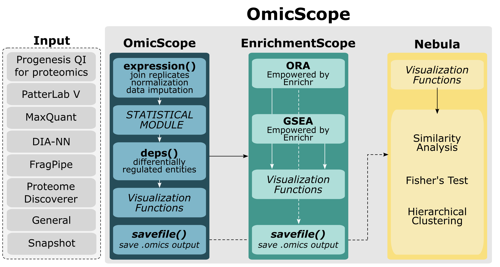

========
Overview
========

.. image:: https://readthedocs.org/projects/omicscope/badge/?style=flat
    :target: https://omicscope.readthedocs.io/
    :alt: Documentation Status

.. image:: https://img.shields.io/pypi/v/omicscope.svg
    :alt: PyPI Package latest release
    :target: https://pypi.org/project/omicscope

.. image:: https://img.shields.io/pypi/wheel/omicscope.svg
    :alt: PyPI Wheel
    :target: https://pypi.org/project/omicscope

.. image:: https://img.shields.io/pypi/pyversions/omicscope.svg
    :alt: Supported versions
    :target: https://pypi.org/project/omicscope

.. image:: https://img.shields.io/pypi/implementation/omicscope.svg
    :alt: Supported implementations
    :target: https://pypi.org/project/omicscope

.. image:: https://img.shields.io/github/commits-since/guireiso/omicscope/v1.3.12.svg
    :alt: Commits since latest release
    :target: https://github.com/guireiso/omicscope/compare/v1.3.12...main

OmicScope: OmicScope: from quantitative proteomics to systems biology.
----------------------------------------------------------------------

*OmicScope* is a comprehensive workflow designed to analyze and provide insights on quantitative proteomics data. To date, *OmicScope* works with data generated from `Progenesis QI for Proteomics <https://www.nonlinear.com/progenesis/qi-for-proteomics/>`__, `MaxQuant <https://www.maxquant.org/>`__, `PatternLab V <http://www.patternlabforproteomics.org/>`__, and DIA-NN. Additionally, a fourth generic input can be used, enabling users to run *OmicScope* with data from different platforms, such as transcriptomics. For users that previously performed statistical analysis, OmicScope provides the Snapshot method to quickly import data.

*OmicScope* can perform differential expression analysis in both static and longitudinal experimental designs. For static experiments, proteins that are differentially regulated are determined by t-tests (for 2 group comparison) or One-way ANOVA (for >2 group comparison); while for longitudinal analysis, *OmicScope* performs the pipeline suggested by Storey, 2005.

Once the differential expression data is obtained, the user can perform Over-Representation Analysis (ORA) or Gene-Set Enrichment Analysis (GSEA), which are implemented according to `GSEApy <https://gseapy.readthedocs.io/>`__ in the EnrichmentScope module.

Both differential expression and enrichment analyses have a comprehensive visualization toolkit generated by *OmicScope*, including dotplots, networks, heatmaps, etc.

Finally, for each experiment performed by *OmicScope*, it is possible to export an omics file (.omics extension) for further use in the **Nebula workflow**. Nebula is a specialized module that enables analysis of multiple studies or comparisons, providing several types of analysis to compare those groups and find similarities among them.

Installation
------------

::

    pip install omicscope

You can also install the in-development version with::

    pip install https://github.com/guireiso/omicscope/archive/main.zip

Note: OmicScope uses the package SciPy, which requires a fortran compiler to be installed to build its source,which can be tricky on some systems. An alternative to this is to use Anaconda environment. OmicScope can then be more easily installed within this environment, using the command line or preferred method.

Note2: Installing OmicScope may take some time on certain systems. If you observe the command line halting, please be patient, as the installation process may require seconds to minutes to complete.

Documentation
-------------

https://omicscope.readthedocs.io/

Demo
----

In the repository, specifically in tests/data/proteins, you'll discover raw protein quantification data for executing both OmicScope and EnrichmentScope pipelines. Furthermore, within tests/data/MultipleGroups/omics_file, you'll locate the omics outputs suitable for utilization in the Nebula pipeline.

