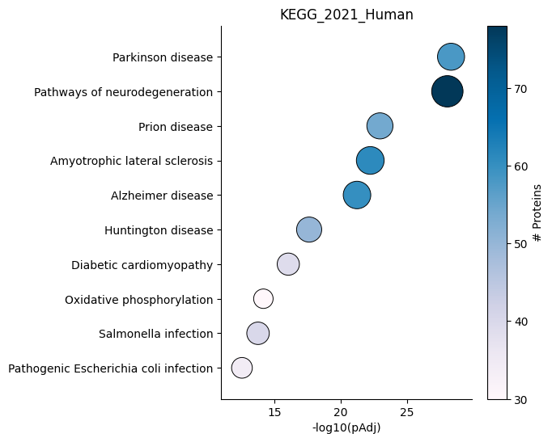
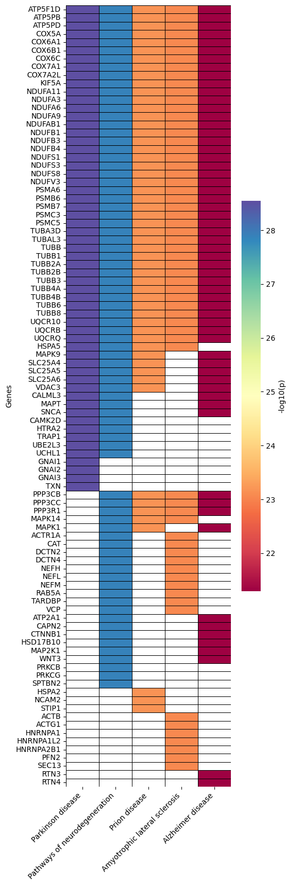
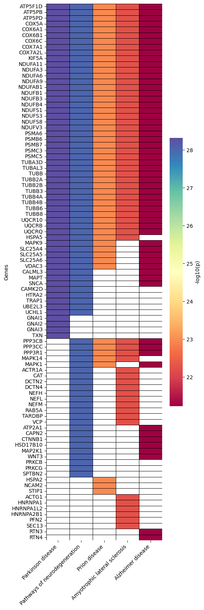
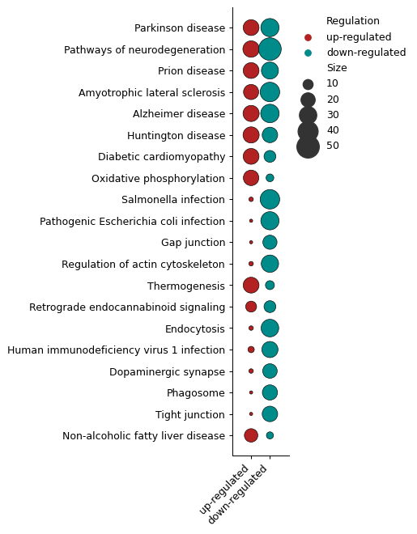
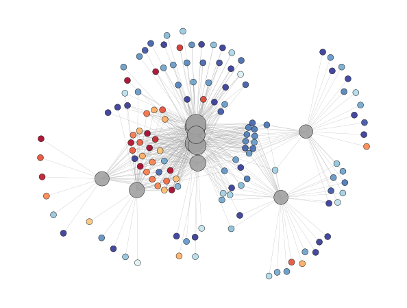

EnrichmentScope Object
======================

The EnrichmentScope is a dedicated module within OmicScope designed for conducting in silico enrichment analyses. It offers two primary types of enrichment analyses: Over-Representation Analysis (ORA) and Gene-Set Enrichment Analysis (GSEA). These analyses are powered by the GSEAPy package workflow, providing high performance and access to a comprehensive list of databases for thorough analysis.

.. code-block:: python

   import omicscope as omics

   df = omics.OmicScope('../../tests/data/proteins/progenesis.xls', Method = 'Progenesis')

   ora = omics.EnrichmentScope(df, Analysis='ORA', dbs = ['KEGG_2021_Human'])

.. code-block::

   User already performed statistical analysis
   OmicScope identifies: 697 deregulations

Enrichment results
------------------

Enrichment results are stored in ``object.results`` as a table (DataFrame). This data contains all the information regarding the analyses that were run, such as the databases used to search (\ ``Gene_Set``\ ), their respective enriched terms (\ ``Term``\ ), the statistics returned for each term (\ ``P-value``\ , ``Adjusted P-value``\ , ``Odds Ratio``\ , ``Combined Score``\ ), the genes and number of genes associated with those terms (\ ``Genes``\ , ``N_Proteins``\ ), the regulation of each gene on the original data frame (\ ``regulation``\ ), and how much of the data is down- and up-regulated.

.. code-block:: python

   ora.results.head(4)

.. raw:: html

   

   
   <table border="1" class="dataframe">
     <thead>
       <tr style="text-align: right;">
         <th></th>
         <th>Gene_set</th>
         <th>Term</th>
         <th>Overlap</th>
         <th>P-value</th>
         <th>Adjusted P-value</th>
         <th>Old P-value</th>
         <th>Old Adjusted P-value</th>
         <th>Odds Ratio</th>
         <th>Combined Score</th>
         <th>Genes</th>
         <th>-log10(pAdj)</th>
         <th>N_Proteins</th>
         <th>regulation</th>
         <th>down-regulated</th>
         <th>up-regulated</th>
       </tr>
     </thead>
     <tbody>
       <tr>
         <th>0</th>
         <td>KEGG_2021_Human</td>
         <td>Parkinson disease</td>
         <td>58/249</td>
         <td>1.704579e-31</td>
         <td>4.789868e-29</td>
         <td>0</td>
         <td>0</td>
         <td>9.082385</td>
         <td>643.458087</td>
         <td>[NDUFA11, CALML3, COX6A1, UBE2L3, TUBB8, UCHL1...</td>
         <td>28.319676</td>
         <td>58</td>
         <td>[0.2670808325175823, -0.10715415448907055, 0.7...</td>
         <td>33</td>
         <td>25</td>
       </tr>
       <tr>
         <th>1</th>
         <td>KEGG_2021_Human</td>
         <td>Pathways of neurodegeneration</td>
         <td>78/475</td>
         <td>6.471702e-31</td>
         <td>9.092742e-29</td>
         <td>0</td>
         <td>0</td>
         <td>6.000855</td>
         <td>417.135594</td>
         <td>[NDUFA11, CALML3, ATP2A1, COX6A1, UBE2L3, TUBB...</td>
         <td>28.041305</td>
         <td>78</td>
         <td>[0.2670808325175823, -0.10715415448907055, -0....</td>
         <td>51</td>
         <td>27</td>
       </tr>
       <tr>
         <th>2</th>
         <td>KEGG_2021_Human</td>
         <td>Prion disease</td>
         <td>54/273</td>
         <td>1.174929e-25</td>
         <td>1.100517e-23</td>
         <td>0</td>
         <td>0</td>
         <td>7.318264</td>
         <td>420.093386</td>
         <td>[NDUFA11, COX6A1, TUBB8, PPP3CB, TUBB6, PPP3CC...</td>
         <td>22.958403</td>
         <td>54</td>
         <td>[0.2670808325175823, 0.7932637717587971, -0.33...</td>
         <td>29</td>
         <td>25</td>
       </tr>
       <tr>
         <th>3</th>
         <td>KEGG_2021_Human</td>
         <td>Amyotrophic lateral sclerosis</td>
         <td>61/364</td>
         <td>8.377698e-25</td>
         <td>5.885333e-23</td>
         <td>0</td>
         <td>0</td>
         <td>6.014281</td>
         <td>333.426032</td>
         <td>[NDUFA11, COX6A1, ACTG1, TUBB8, ACTR1A, PPP3CB...</td>
         <td>22.230229</td>
         <td>61</td>
         <td>[0.2670808325175823, 0.7932637717587971, -0.22...</td>
         <td>38</td>
         <td>23</td>
       </tr>
     </tbody>
   </table>
   

Background
----------

When conducting Over-Representation Analysis (ORA), the background gene list assumes a pivotal role in enrichment analysis by serving as the reference set against which the experimental gene list is compared. To put it simply, the background gene list encompasses all the genes or proteins that could potentially be present in the experimental dataset.

By default, when ``background = None``\ , EnrichmentScope includes all genes found in the database as part of the background. Alternatively, users have the option to set ``background = True`` to encompass all proteins identified in the experiment. They can also use ``background = int`` to specify the background size, which could be, for instance, the reviewed human proteome in the case of human experiments (although this is not recommended). Another option is to define background = ``[ListOfGenes]`` to specify a particular gene set for comparative analysis.

Plots and Figures
-----------------

EnrichmentScope introduces a variety of analysis options and plot figures tailored to offer users a comprehensive understanding of the impact of differentially regulated proteins on biological systems.

Users can choose between saving the generated plots in vector format (using ``vector=True``\ ) or in .png format (with ``vector=False``\ ). They have the flexibility to set the desired figure resolution (using ``dpi=300``\ ) and specify a file path for saving the plots. Moreover, users can adjust the color schemes of the plots using the "palettes" command, selecting color palettes from Matplotlib. These customizable options empower users to create informative and visually appealing visualizations that cater to their specific requirements and preferences.

Dotplot - ``object.dotplot()``
^^^^^^^^^^^^^^^^^^^^^^^^^^^^^^^^^^

The ``dotplot`` function within EnrichmentScope ranks enriched terms based on their adjusted p-values. Each dot's size and color in the plot correspond to the number of proteins enriched for the respective term.

.. code-block:: python

   ora.dotplot(dpi=90, palette='PuBu')

Heatmap - ``object.Heatmap()``
^^^^^^^^^^^^^^^^^^^^^^^^^^^^^^^^^^

The heatmap is a valuable tool within the EnrichmentScope workflow, aiding in the visualization of proteins that are shared between enriched terms. This visualization is particularly helpful in reducing data redundancy. By default, the heatmap colors are mapped according to the adjusted p-value. However, users have the option to color each protein based on its fold-change by setting ``foldchange=True``.

.. code-block:: python

   ora.heatmap(linewidths=0.5)

.. code-block:: python

   ora.heatmap(linewidths=0.5, foldchange=True)

Number of DEPs - ``object.number_deps()``
^^^^^^^^^^^^^^^^^^^^^^^^^^^^^^^^^^^^^^^^^^^^

For users performing ORA and GSEA analyses, questions often arise about the number of differentially regulated entities. The ``number_deps`` function addresses this by providing insights into the count of up- and down-regulated entities.

.. code-block:: python

   ora.number_deps(palette=['firebrick','darkcyan'] ,dpi = 90)

Enrichment Network - ``object.enrichment_network()``
^^^^^^^^^^^^^^^^^^^^^^^^^^^^^^^^^^^^^^^^^^^^^^^^^^^^^^^

In proteomics, major pathways frequently share several proteins, and visualizing pathways and proteins together in a network can be highly informative. OmicScope offers two functions for plotting networks: ``enrichment_network`` and ``enrichment_map``.

The Enrichment Network function visually connects terms to their associated proteins. In this visualization, terms are depicted in gray, and the node size is proportional to ``-log10(p-adjusted)``. Proteins are represented uniformly in size and are color-coded based on their fold-change. Labels can be added to the plot by using the ``labels``\ =True option (default: ``False``\ ).

**Note**\ : Note: Visualizing graphs can be complex, particularly when dealing with substantial amounts of information. To achieve the best visualization possible, several software options, such as Cytoscape and Gephi, have been specifically designed for this purpose. Users can export the plot to these external tools by specifying ``save=PATH_TO_SAVE``.

.. code-block:: python

   ora.enrichment_network(top = 10, dpi = 90)

.. code-block::

   [<networkx.classes.graph.Graph at 0x1863c307410>]

Enrichment Map - ``object.enrichment_map()``
^^^^^^^^^^^^^^^^^^^^^^^^^^^^^^^^^^^^^^^^^^^^^^^

An advantageous aspect of employing graphical representations in enrichment analysis is their ability to reduce data redundancy. The enrichment_map function takes advantage of this by rendering nodes as terms and edges as similarity scores, typically calculated using statistical metrics such as Jaccard similarity (default). If users opt to enable ``modules=True``\ , the Louvain method is utilized to identify communities within the network. Each community is assigned a unique term, typically the one with the highest degree, to describe the community when ``labels=True`` is specified.

Similar to the ``enrichment_network`` function, users can easily export the generated enrichment map to external tools for further exploration and visualization by adding ``save=PATH_TO_SAVE``.

.. code-block:: python

   ora.enrichment_map(dpi=90, modules=True)

.. image:: 4_enrichmentscope_files/4_enrichmentscope_17_0.png
   :target: 4_enrichmentscope_files/4_enrichmentscope_17_0.png
   :alt: png

.. code-block::

   [<networkx.classes.graph.Graph at 0x1863d11cad0>]

.. code-block:: python

