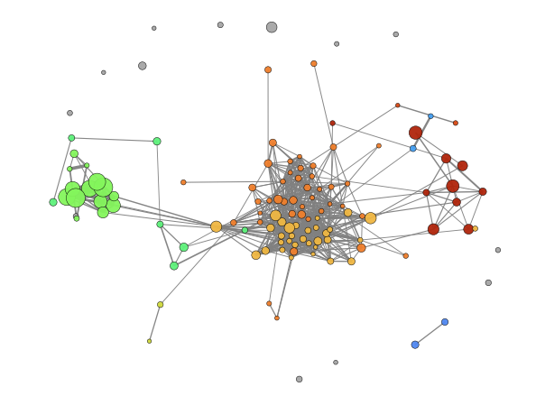

======================
EnrichmentScope Object
======================

EnrichmentScope is the OmicScope module designed to perform *in silico* enrichment analyses, which can be: 1) over-representation analysis (\ **ORA**\ ); or 2) Gene-Set Enrichment Analysis (\ **GSEA**\ ). To perform ORA (Analysis='ORA') and GSEA (Analysis='GSEA'), OmicScope employs `GSEAPy package <https://gseapy.readthedocs.io/>`_ workflow, which enables high performance and a comprehensive list of databases to run the analysis.

.. code-block:: python

   import omicscope as omics

   df = omics.OmicScope(PATH_TO_FILE, Method = 'Progenesis', ControlGroup = 'WT')

   ora = omics.EnrichmentScope(df, Analysis='ORA', dbs = ['Reactome_2022','KEGG_2021_Human'])

.. code-block::

   OmicScope v 1.0.1 For help: Insert
   If you use  in published research, please cite: 'lallalala'
   Reis-de-Oliveira G, Martins-de-Souza D. OmicScope: an Comprehensive Python library for Systems Biology Visualization.

   User already performed statistical analysis

Enrichment results
==================

Enrichment results are stored in *object.results* as a table (DataFrame). This data contains all the information regarding the analyses that were run, such as the databases used to search (Gene_Set), their respective enriched terms (Term), the statistics returned for each term (P-value, Adjusted P-value, Odds Ratio, Combined Score), the genes and number of genes associated with those terms (Genes, N_Proteins), the regulation of each gene on the original data frame (regulation), and how much of the data is down- and up-regulated.

.. code-block:: python

   ora.results.head(4)

.. raw:: html

   

   
   <table border="1" class="dataframe">
     <thead>
       <tr style="text-align: right;">
         <th></th>
         <th>Gene_set</th>
         <th>Term</th>
         <th>Overlap</th>
         <th>P-value</th>
         <th>Adjusted P-value</th>
         <th>Old P-value</th>
         <th>Old Adjusted P-value</th>
         <th>Odds Ratio</th>
         <th>Combined Score</th>
         <th>Genes</th>
         <th>N_Proteins</th>
         <th>-log10(pAdj)</th>
         <th>regulation</th>
         <th>down-regulated</th>
         <th>up-regulated</th>
       </tr>
     </thead>
     <tbody>
       <tr>
         <th>0</th>
         <td>Reactome_2022</td>
         <td>Metabolism R-HSA-1430728</td>
         <td>82/2049</td>
         <td>3.104102e-23</td>
         <td>2.563988e-20</td>
         <td>0</td>
         <td>0</td>
         <td>4.549346</td>
         <td>235.777761</td>
         <td>[SLC25A1, PYGB, ACAA2, ACSM3, HIBADH, COX4I1, ...</td>
         <td>82</td>
         <td>19.591084</td>
         <td>[-0.5906221976792417, -0.17868588462982063, -0...</td>
         <td>71</td>
         <td>11</td>
       </tr>
       <tr>
         <th>1</th>
         <td>Reactome_2022</td>
         <td>Translation R-HSA-72766</td>
         <td>25/281</td>
         <td>1.047296e-14</td>
         <td>4.325335e-12</td>
         <td>0</td>
         <td>0</td>
         <td>8.655451</td>
         <td>278.618788</td>
         <td>[EIF4A2, GFM1, RPN1, MRPL12, RPL7A, RPS16, QAR...</td>
         <td>25</td>
         <td>11.363980</td>
         <td>[-0.18835553622839196, 0.18055875893061113, -0...</td>
         <td>24</td>
         <td>1</td>
       </tr>
       <tr>
         <th>2</th>
         <td>Reactome_2022</td>
         <td>Cellular Responses To Stress R-HSA-2262752</td>
         <td>37/722</td>
         <td>1.494016e-13</td>
         <td>4.113524e-11</td>
         <td>0</td>
         <td>0</td>
         <td>4.952204</td>
         <td>146.249169</td>
         <td>[CAMK2D, PSMD11, COX4I1, COX5B, COX7C, PSMD8, ...</td>
         <td>37</td>
         <td>10.385786</td>
         <td>[0.5206560366318922, -0.25501611892848614, -0....</td>
         <td>34</td>
         <td>3</td>
       </tr>
       <tr>
         <th>3</th>
         <td>Reactome_2022</td>
         <td>Cellular Responses To Stimuli R-HSA-8953897</td>
         <td>37/736</td>
         <td>2.673533e-13</td>
         <td>5.520846e-11</td>
         <td>0</td>
         <td>0</td>
         <td>4.849455</td>
         <td>140.392726</td>
         <td>[CAMK2D, PSMD11, COX4I1, COX5B, COX7C, PSMD8, ...</td>
         <td>37</td>
         <td>10.257994</td>
         <td>[0.5206560366318922, -0.25501611892848614, -0....</td>
         <td>34</td>
         <td>3</td>
       </tr>
     </tbody>
   </table>
   

Plots and Figures
=================

As described in the OmicScope module, EnrichmentScope supports multiple analyses and plot figures. These plots were specially designed to give users an overview of the effect of differentially regulated proteins on biological systems.

To save figures, the user can choose between a vector (vector=True) or a .png extension (vector=False), the figure resolution (dpi=300), and the path to save figures. Additionally, the colors of plots can be changed using the palettes command and the following color palettes as described in `Matplotlib <https://matplotlib.org/stable/tutorials/colors/colormaps.html>`_ (default: palette='Spectral').

Dotplot - *object.dotplot()*
--------------------------------

The dotplot function ranks terms according to adjusted p-values; the colors and sizes of each dot are proportional to the number of proteins enriched for their respective terms.

.. code-block:: python

   ora.dotplot(dpi=90)

.. image:: enrichmentscope_files/enrichmentscope_7_0.png
   :target: enrichmentscope_files/enrichmentscope_7_0.png
   :alt: png

.. image:: enrichmentscope_files/enrichmentscope_7_1.png
   :target: enrichmentscope_files/enrichmentscope_7_1.png
   :alt: png

Heatmap - *object.Heatmap()*
--------------------------------

In the EnrichmentScope workflow, the heatmap is used to visualize proteins that are shared between the enriched Terms, which can help with data redundancy. By default, the colors are mapped according to the adjusted p-value, however, the users can color each protein according to their respective fold-change (foldchange=True).

.. code-block:: python

   ora.heatmap(linewidths=0.5)

.. image:: enrichmentscope_files/enrichmentscope_9_0.png
   :target: enrichmentscope_files/enrichmentscope_9_0.png
   :alt: png

.. image:: enrichmentscope_files/enrichmentscope_9_1.png
   :target: enrichmentscope_files/enrichmentscope_9_1.png
   :alt: png

.. code-block:: python

   ora.heatmap(linewidths=0.5, foldchange=True)

.. image:: enrichmentscope_files/enrichmentscope_10_0.png
   :target: enrichmentscope_files/enrichmentscope_10_0.png
   :alt: png

.. image:: enrichmentscope_files/enrichmentscope_10_1.png
   :target: enrichmentscope_files/enrichmentscope_10_1.png
   :alt: png

Number of DEPs - *object.number_deps()*
-------------------------------------------

Since ORA and GSEA take into account differentially regulated proteins/genes, a further question can be asked regarding the number of these entities that are up- or down-regulated. 

.. code-block:: python

   ora.number_deps(palette=['firebrick','darkcyan'] ,dpi = 90)

.. image:: enrichmentscope_files/enrichmentscope_12_0.png
   :target: enrichmentscope_files/enrichmentscope_12_0.png
   :alt: png

.. image:: enrichmentscope_files/enrichmentscope_12_1.png
   :target: enrichmentscope_files/enrichmentscope_12_1.png
   :alt: png

Enrichment Network - *object.enrichment_network()*
------------------------------------------------------

Since major pathways share several proteins/genes, pathways and proteins can be visualized together using graphs/networks. OmicScope includes two functions to plot networks: enrichment_network and enrichment_map. The first one is the Enrichment Network, which plots terms linked to their respective proteins. While terms are plotted in gray color and node size is proportional to -log10(p-adjusted); proteins are plotted in uniform size and are colored according to their fold-change. Additionally, the labels can be added to plot with labels=True (default: False).

Plot graphs can be very challenging, depending on the amount of information that needs to be shown. There are several software options specifically designed to provide the best visualization possible, such as Cytoscape and Gephi. To export the plot to other tools, the users just need to add save=PATH_TO_SAVE.

.. code-block:: python

   ora.enrichment_network(top = 10, dpi = 90)

.. image:: enrichmentscope_files/enrichmentscope_14_0.png
   :target: enrichmentscope_files/enrichmentscope_14_0.png
   :alt: png

.. image:: enrichmentscope_files/enrichmentscope_14_1.png
   :target: enrichmentscope_files/enrichmentscope_14_1.png
   :alt: png

.. code-block::

   [<networkx.classes.graph.Graph at 0x29535706c90>,
    <networkx.classes.graph.Graph at 0x29535673a50>]

Enrichment Map - *object.enrichment_map()*
----------------------------------------------

Another advantage of graphs in enrichment analysis is that they reduce the redundancy of the data. The enrichment_map function plots nodes as terms and edges as Pearson's correlation between these terms. If users define modules=True, the Louvain method is used to detect communities and assign a unique term (highest degree) to describe that community (if labels=True). Finally, as provided by the enrichment_network function, to export the plot to other tools, the user only needs to add save=PATH_TO_SAVE.

.. code-block:: python

   ora.enrichment_map(dpi=90, modules=True)

.. image:: enrichmentscope_files/enrichmentscope_16_1.png
   :target: enrichmentscope_files/enrichmentscope_16_1.png
   :alt: png

.. code-block::

   [<networkx.classes.graph.Graph at 0x29531889010>,
    <networkx.classes.graph.Graph at 0x29531479b50>]
