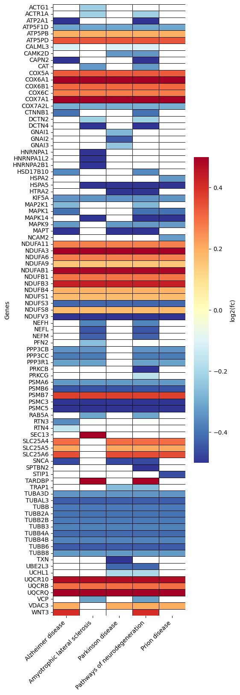

EnrichmentScope Object
======================

The EnrichmentScope is a module within OmicScope designed to perform *in silico* enrichment analyses, including over-representation analysis (ORA) and Gene-Set Enrichment Analysis (GSEA). To run ORA (Analysis='ORA') or GSEA (Analysis='GSEA'), OmicScope uses the GSEAPy package workflow, which provides high performance and access to a comprehensive list of databases for the analysis.

.. code-block:: python

   import omicscope as omics

   df = omics.OmicScope('../tests/data/proteins/progenesis.xls', Method = 'Progenesis')

   ora = omics.EnrichmentScope(df, Analysis='ORA', dbs = ['KEGG_2021_Human'])

.. code-block::

   OmicScope v 1.0.6 For help: Insert
   If you use  in published research, please cite: 'XXXXX'
   Reis-de-Oliveira G, Martins-de-Souza D. OmicScope: from quantitative proteomics to systems biology.

   User already performed statistical analysis
   OmicScope identifies: 721 deregulations

Enrichment results
==================

Enrichment results are stored in ``object.results`` as a table (DataFrame). This data contains all the information regarding the analyses that were run, such as the databases used to search (\ ``Gene_Set``\ ), their respective enriched terms (\ ``Term``\ ), the statistics returned for each term (\ ``P-value``\ , ``Adjusted P-value``\ , ``Odds Ratio``\ , ``Combined Score``\ ), the genes and number of genes associated with those terms (\ ``Genes``\ , ``N_Proteins``\ ), the regulation of each gene on the original data frame (\ ``regulation``\ ), and how much of the data is down- and up-regulated.

.. code-block:: python

   ora.results.head(4)

.. raw:: html

   

   
   <table border="1" class="dataframe">
     <thead>
       <tr style="text-align: right;">
         <th></th>
         <th>Gene_set</th>
         <th>Term</th>
         <th>Overlap</th>
         <th>P-value</th>
         <th>Adjusted P-value</th>
         <th>Old P-value</th>
         <th>Old Adjusted P-value</th>
         <th>Odds Ratio</th>
         <th>Combined Score</th>
         <th>Genes</th>
         <th>N_Proteins</th>
         <th>-log10(pAdj)</th>
         <th>regulation</th>
         <th>down-regulated</th>
         <th>up-regulated</th>
       </tr>
     </thead>
     <tbody>
       <tr>
         <th>0</th>
         <td>KEGG_2021_Human</td>
         <td>Parkinson disease</td>
         <td>59/249</td>
         <td>1.006473e-31</td>
         <td>2.828189e-29</td>
         <td>0</td>
         <td>0</td>
         <td>8.982209</td>
         <td>641.093359</td>
         <td>[NDUFA11, CALML3, COX6A1, UBE2L3, TUBB8, UCHL1...</td>
         <td>59</td>
         <td>28.548492</td>
         <td>[0.2670808325175823, -0.10715415448907055, 0.7...</td>
         <td>34</td>
         <td>25</td>
       </tr>
       <tr>
         <th>1</th>
         <td>KEGG_2021_Human</td>
         <td>Pathways of neurodegeneration</td>
         <td>79/475</td>
         <td>9.129397e-31</td>
         <td>1.282680e-28</td>
         <td>0</td>
         <td>0</td>
         <td>5.886660</td>
         <td>407.172226</td>
         <td>[NDUFA11, CALML3, ATP2A1, COX6A1, UBE2L3, TUBB...</td>
         <td>79</td>
         <td>27.891882</td>
         <td>[0.2670808325175823, -0.10715415448907055, -0....</td>
         <td>52</td>
         <td>27</td>
       </tr>
       <tr>
         <th>2</th>
         <td>KEGG_2021_Human</td>
         <td>Prion disease</td>
         <td>55/273</td>
         <td>7.275815e-26</td>
         <td>6.815013e-24</td>
         <td>0</td>
         <td>0</td>
         <td>7.243181</td>
         <td>419.254584</td>
         <td>[NDUFA11, COX6A1, TUBB8, PPP3CB, TUBB6, PPP3CC...</td>
         <td>55</td>
         <td>23.166533</td>
         <td>[0.2670808325175823, 0.7932637717587971, -0.33...</td>
         <td>30</td>
         <td>25</td>
       </tr>
       <tr>
         <th>3</th>
         <td>KEGG_2021_Human</td>
         <td>Amyotrophic lateral sclerosis</td>
         <td>63/364</td>
         <td>1.203708e-25</td>
         <td>8.456051e-24</td>
         <td>0</td>
         <td>0</td>
         <td>6.055729</td>
         <td>347.473001</td>
         <td>[NDUFA11, COX6A1, ACTB, ACTG1, TUBB8, ACTR1A, ...</td>
         <td>63</td>
         <td>23.072832</td>
         <td>[0.2670808325175823, 0.7932637717587971, -0.22...</td>
         <td>40</td>
         <td>23</td>
       </tr>
     </tbody>
   </table>
   

Plots and Figures
=================

EnrichmentScope supports multiple analyses and plot figures that are specifically designed to provide users with an overview of the effect of differentially regulated proteins on biological systems.

Users can choose between saving the plots in vector (vector=True) or .png (vector=False) formats, set the desired figure resolution (dpi=300), and specify a file path for saving the plots. Furthermore, users can modify the color schemes of the plots using the "palettes" command and select color palettes from Matplotlib. By providing these options, EnrichmentScope enables users to create highly customizable and informative visualizations that are tailored to their specific needs and preferences.

Dotplot - *object.dotplot()*
--------------------------------

The ``dotplot`` function in EnrichmentScope ranks terms based on adjusted p-values. The size and color of each dot in the plot are proportional to the number of proteins that are enriched for the respective term.

.. code-block:: python

   ora.dotplot(dpi=90, palette='PuBu')

.. image:: enrichmentscope_files/enrichmentscope_7_0.png
   :target: enrichmentscope_files/enrichmentscope_7_0.png
   :alt: png

Heatmap - *object.Heatmap()*
--------------------------------

In the EnrichmentScope workflow, the heatmap is used to visualize proteins that are shared between the enriched Terms, which can help with data redundancy. By default, the colors are mapped according to the adjusted p-value. However, users can also choose to color each protein according to their respective fold-change by setting ``foldchange=True``.

.. code-block:: python

   ora.heatmap(linewidths=0.5)

.. image:: enrichmentscope_files/enrichmentscope_9_0.png
   :target: enrichmentscope_files/enrichmentscope_9_0.png
   :alt: png

.. code-block:: python

   ora.heatmap(linewidths=0.5, foldchange=True)

Number of DEPs - *object.number_deps()*
-------------------------------------------

Since ORA and GSEA take into account differentially regulated proteins/genes, further questions can arise regarding the number of entities that are up- or down-regulate. 

.. code-block:: python

   ora.number_deps(palette=['firebrick','darkcyan'] ,dpi = 90)

.. image:: enrichmentscope_files/enrichmentscope_12_0.png
   :target: enrichmentscope_files/enrichmentscope_12_0.png
   :alt: png

Enrichment Network - *object.enrichment_network()*
------------------------------------------------------

Since major pathways share several proteins/genes, pathways and proteins can be visualized together using graphs/networks. OmicScope includes two functions to plot networks: ``enrichment_network`` and ``enrichment_map``. 

The first one is the Enrichment Network, which plots terms linked to their respective proteins. While terms are plotted in gray color and node size is proportional to ``-log10(p-adjusted)``\ ; proteins are plotted in uniform size and are colored according to their fold-change. Additionally, the labels can be added to plot with ``labels=True`` (default: ``False``\ ).

**Note**\ : Plotting graphs can be challenging depending on the amount of information that needs to be shown. There are several software options specifically designed to provide the best visualization possible, such as Cytoscape and Gephi. To export the plot to other tools, users can add ``save=PATH_TO_SAVE``.

.. code-block:: python

   ora.enrichment_network(top = 10, dpi = 90)

.. code-block::

   [<networkx.classes.graph.Graph at 0x258427b6a50>]

Enrichment Map - *object.enrichment_map()*
----------------------------------------------

Another advantage of graphs in enrichment analysis is that they can help reduce data redundancy. The ``enrichment_map`` function plots nodes as terms and edges as a similarity score, determined by statistical metrics (default: 'jaccard'). If users define ``modules=True``\ , the Louvain method is used to detect communities and assign a unique term (highest degree) to describe that community (if ``labels=True``\ ). Finally, as with the ``enrichment_network`` function, to export the plot to other tools, the user only needs to add ``save=PATH_TO_SAVE``.

.. code-block:: python

   ora.enrichment_map(dpi=90, modules=True)

.. image:: enrichmentscope_files/enrichmentscope_16_0.png
   :target: enrichmentscope_files/enrichmentscope_16_0.png
   :alt: png

.. code-block::

   [<networkx.classes.graph.Graph at 0x258427ed6d0>]
