Nebula
======

Nebula is the module that allows multi-data integration and provides various functions for analyzing independent proteomics experiments. Thanks to the *General and Snapshot input workflows* performed by the OmicScope, Nebula can also analyze multi-omics data.

To initiate the Nebula workflow, you need a folder containing .omics files that have been exported from the OmicScope and/or EnrichmentScope workflows.

Exporting **.omics** files - ``object.savefile()``
----------------------------------------------------------

Both OmicScope and EnrichmentScope offer a convenient function, ``savefile``\ , for exporting data. This function enables the export of *quantitative data* from OmicScope and *quantitative and enrichment data* from EnrichmentScope. To export, simply invoke the ``savefile`` function and specify the folder path where you want to save the data.

.. code-block:: python

   # OmicScope Example
   import omicscope as omics

   df = omics.OmicScope('../tests/data/proteins/progenesis.xls', Method='Progenesis')
   df.savefile(PATH_TO_SAVE)

   # EnrichmentScope Example
   # Note: EnrichmentScope also includes QUANTITATIVE DATA
   enr = omics.EnrichmentScope(df)
   enr.savefile(PATH_TO_SAVE)

By default, the exported file name in OmicScope/EnrichmentScope is derived from the conditions extracted during the analysis. For example, if you analyzed data with conditions "COVID" and "CTRL," the exported file name would be 'COVID-CTRL.omics'.

.. code-block:: python

   df.Conditions

.. code-block::

   ['COVID', 'CTRL']

Nebula Object
-------------

Nebula seamlessly processes quantitative and enrichment data from .omics files. The experimental group is automatically extracted from the .omics file, which can be further customized by the user. This group name is used to identify the respective experiment. Nebula reports the number of imported groups/experiments, their names, and the inclusion of enrichment data.

.. code-block:: python

   import omicscope as omics

   nebula = omics.Nebula('../../tests/data/MultipleGroups/omics_file/')

.. code-block::

   You imported your data successfully!
           Data description:
           1. N groups imported: 4
           2. Groups: COVID,Covid_HB,NEURONS,SH_DIF
           3. N groups with enchment data: 4

The names of each group can also be altered via the command line, granting users full control over experiment identification.

.. code-block:: python

   nebula.groups = ['Astrocytes', 'Human_Brain', 'Neurons', 'SHSY5Y']
   nebula.groups

.. code-block::

   ['Astrocytes', 'Human_Brain', 'Neurons', 'SHSY5Y']

Figures and plots
-----------------

Barplot - ``object.barplot()``
^^^^^^^^^^^^^^^^^^^^^^^^^^^^^^^^^^

The Nebula barplot displays quantified and differentially regulated proteins/genes across all studies. 

.. code-block:: python

   nebula.barplot(dpi=90)

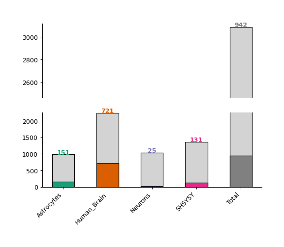

Enrichment Dotplot - ``object.dotplot_enrichment()``
^^^^^^^^^^^^^^^^^^^^^^^^^^^^^^^^^^^^^^^^^^^^^^^^^^^^^^^^

When your ``.omics`` files contain enrichment results, you can utilize the ``dotplot_enrichment()`` function to compare the enrichment for each group. By default, the function generates a list of the top 5 terms for each imported group based on p-values, then uses this list to filter each enrichment data for comparison.

.. code-block:: python

   nebula.dotplot_enrichment(top=20, dpi=90, fig_height=10)

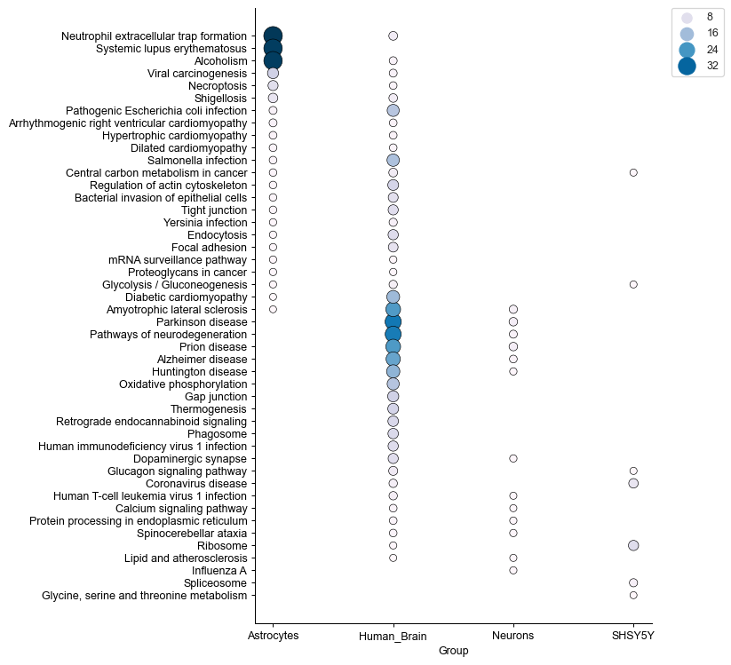

Differentially regulated - `object.diff_reg()``
^^^^^^^^^^^^^^^^^^^^^^^^^^^^^^^^^^^^^^^^^^^^^^^

Nebula's comparison between groups focuses on differentially regulated levels, offering insights into the count of up-regulated and down-regulated proteins.

.. code-block:: python

   nebula.diff_reg(dpi=90)

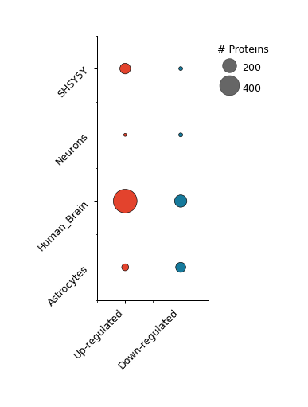

Protein Overlap - ``object.protein_overlap()``
^^^^^^^^^^^^^^^^^^^^^^^^^^^^^^^^^^^^^^^^^^^^^^^^^^

The classic Venn Diagram is a common tool for visualizing overlap and uniqueness between groups. However, conventional Venn diagram tools have limitations when dealing with multiple groups due to overlapping constraints.

Nebula provides an alternative approach with the Upset Plot. This plot allows for the comparison of several groups simultaneously. The lower-left barplot presents the number of entities associated with each group, while the upper-right barplot reveals the intersection size for each comparison, visually represented by colored and linked circles within the frame.

Nebula's protein overlap function conducts comparisons between all groups at the protein level.

.. code-block:: python

   nebula.protein_overlap(dpi=90)

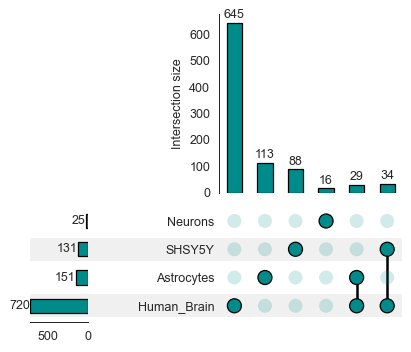

Enrichment Overlap - ``object.protein_overlap()``
^^^^^^^^^^^^^^^^^^^^^^^^^^^^^^^^^^^^^^^^^^^^^^^^^^^^^

Operating similarly to the protein overlap function, the ``enrichment_overlap`` function visualizes the overlap of enriched terms among different groups.

.. code-block:: python

   nebula.enrichment_overlap(dpi=90)

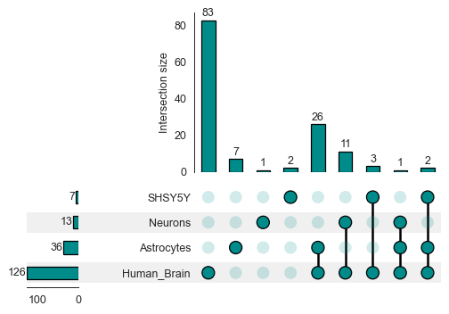

Similarity comparison
^^^^^^^^^^^^^^^^^^^^^

Nebula enables users to gain a deeper understanding of the similarity between different groups based on proteome or differentially regulated protein levels. It calculates the distance between groups using the Jaccard index, although users have the flexibility to specify alternative metrics such as correlation and Euclidean distance. 

**NOTE**\ : while performing Jaccard similarity analysis, Nebula consider the proteins/genes overlaped across studies. Other algorithm (Pearson, Euclidean, etc) considers protein fold-change.

Heatmap - ``object.similarity_heatmap()``
~~~~~~~~~~~~~~~~~~~~~~~~~~~~~~~~~~~~~~~~~~~~~

To facilitate data visualization, Nebula generates a pair-wise comparison heatmap with hierarchical clustering.

.. code-block:: python

   nebula.similarity_heatmap(dpi=90, metric='jaccard')

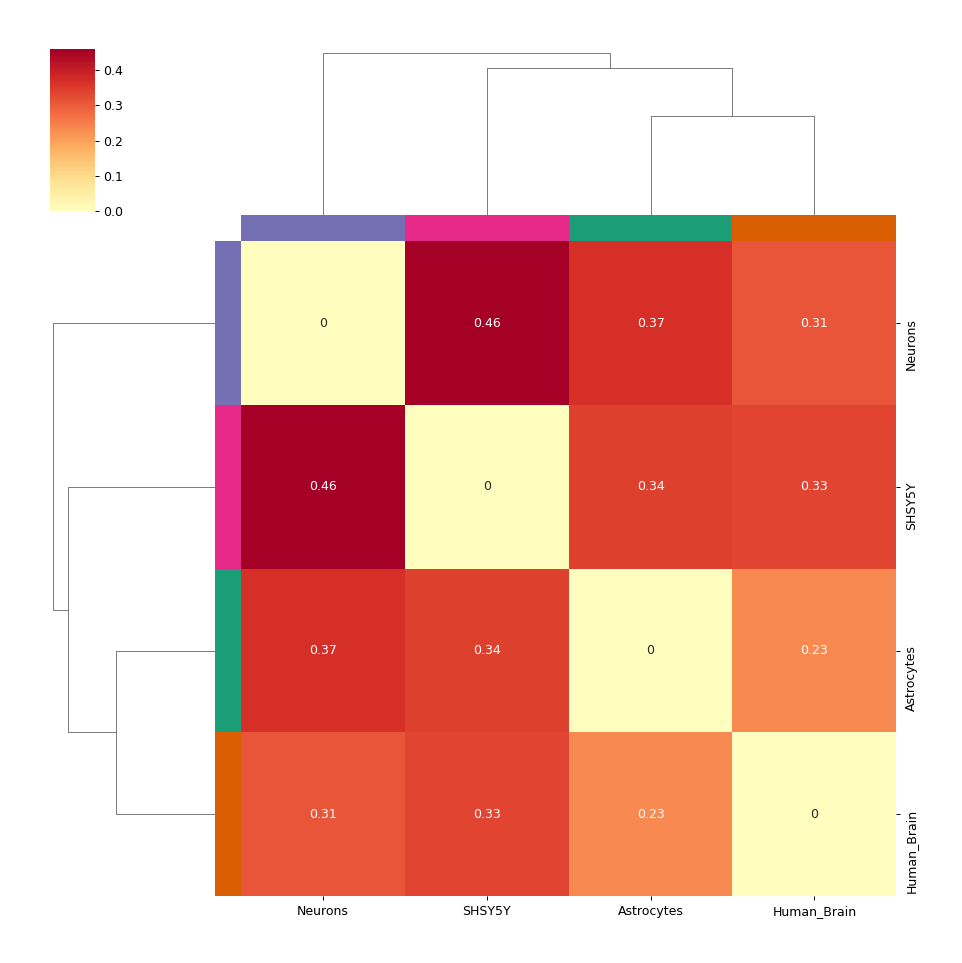

Network - ``object.similarity_network()``
~~~~~~~~~~~~~~~~~~~~~~~~~~~~~~~~~~~~~~~~~~~~~

An alternative approach for visualizing pair-wise comparisons is the use of a network. Users can customize the cutoff for edge assignments according to their preferences.

.. code-block:: python

   nebula.similarity_network(pvalue=1, absolute_similarity_cutoff=0.3, dpi=90)

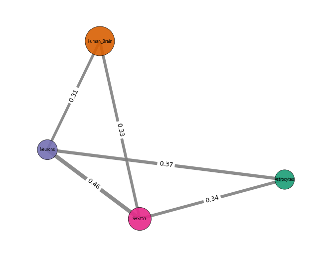

Fisher's test
^^^^^^^^^^^^^

Nebula introduces statistical assessment to determine if the similarity observed across groups is statistically significant. It applies a pairwise Fisher's exact test to provide p-values for the groups. The results can be visualized through a heatmap and/or network.

**NOTE**\ : It's important to highlight that the statistical principles used in this analysis are akin to those employed in an Over-Representation Analysis (ORA). Additionally, users have the flexibility to specify a background against which the analysis is conducted. By default, Nebula considers all imported proteins/genes as the background. However, users also have the option to define a specific number of genes as the background, which can be particularly useful. For example, users may choose to use the number of reviewed proteins in the Human Proteome database as their defined background for the analysis. This level of customization allows for more precise and context-specific analyses.

Heatmap - *object.fisher_heatmap()*
~~~~~~~~~~~~~~~~~~~~~~~~~~~~~~~~~~~~~~~

A heatmap is plotted and colored based on nominal p-values, however, the labels are shown in the log10-scale.

.. code-block:: python

   nebula.fisher_heatmap(pvalue=1, dpi=90)

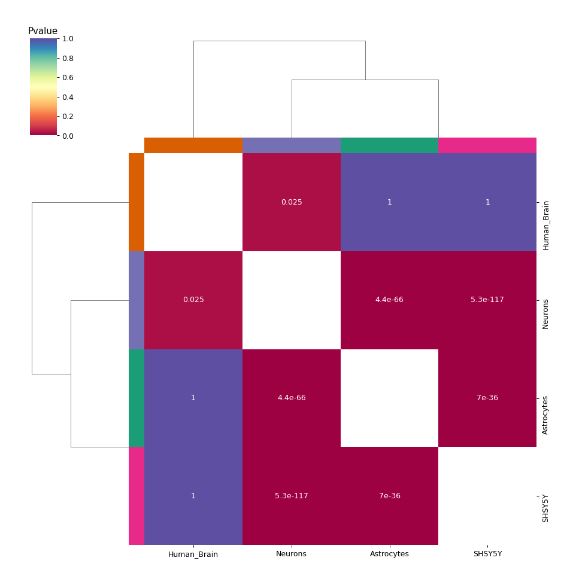

Statistical Network - ``object.stat_network()``
~~~~~~~~~~~~~~~~~~~~~~~~~~~~~~~~~~~~~~~~~~~~~~~~

This function empowers users to filter proteins based on a specific p-value threshold (default: ``protein_pvalue=0.05``\ ) and subsequently applies a pairwise Fisher's exact test. Users can also customize edge filtering based on Fisher's p-value (default: ``graph_pvalue=0.05``\ ) to assign edges to the graph. The graph's labels are displayed in the log10 scale.

.. code-block:: python

   nebula.fisher_network(protein_pvalue=1, graph_pvalue=0.05, dpi=90)

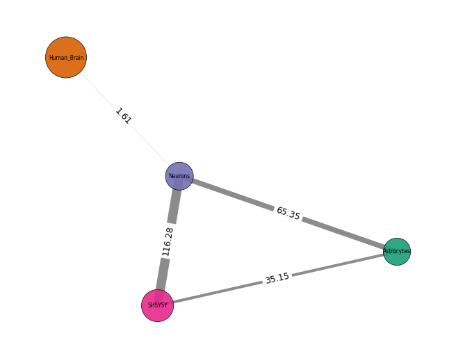

Protein Network - *object.whole_network()*
^^^^^^^^^^^^^^^^^^^^^^^^^^^^^^^^^^^^^^^^^^^^^^

The network function in Nebula offers an insightful overview of individual proteins shared among groups. Employing a systems biology approach, Nebula assists in identifying communities/modules and extracting information based on similarities across the groups. All networks generated in Nebula are exported as .graphml files, which can be imported into programs like Cytoscape and other network visualization software.

.. code-block:: python

   nebula.whole_network(dpi=90)

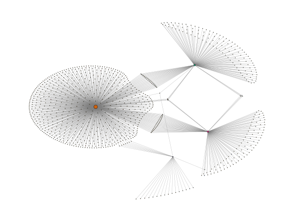

.. code-block::

   <networkx.classes.graph.Graph at 0x291e6be3090>

Circular graphs - ``object.circular_term()``
^^^^^^^^^^^^^^^^^^^^^^^^^^^^^^^^^^^^^^^^^^^^^^^^

The circular plot is designed to compare groups that were enriched for a specific term based on their respective differentially regulated proteins. Additionally, proteins are represented in the plot with their corresponding regulations, denoted as up-regulated (in red) or down-regulated (in blue).

.. code-block:: python

   nebula.circular_term('Amyotrophic lateral sclerosis')

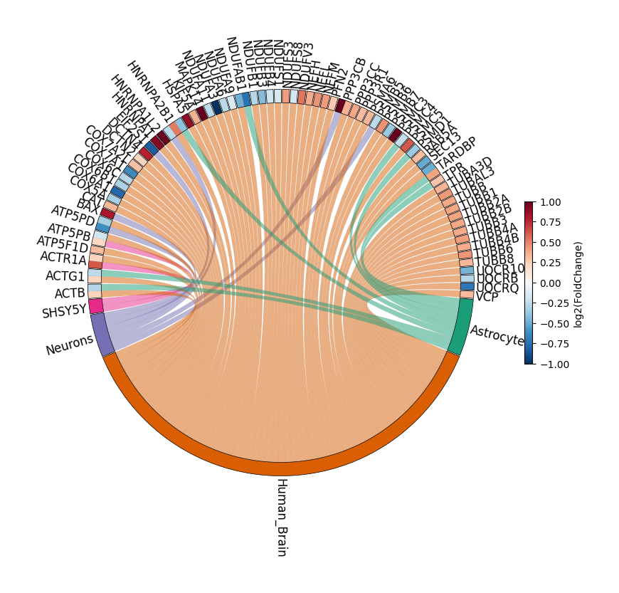

Circos plot - ``object.circos_plot()``
^^^^^^^^^^^^^^^^^^^^^^^^^^^^^^^^^^^^^^^^^^

Circos allows users to visualize differentially regulated proteins across multiple groups and highlights shared proteins with dark cyan links. The regulation of the proteins is depicted using an edge heatmap. If the .omics file contains enrichment analysis, the circos_plot function incorporates shared enrichment terms with orange links, offering insights into the number of pathways shared between groups.

.. code-block:: python

   nebula.circos_plot(colorenrichment='#F56A33')

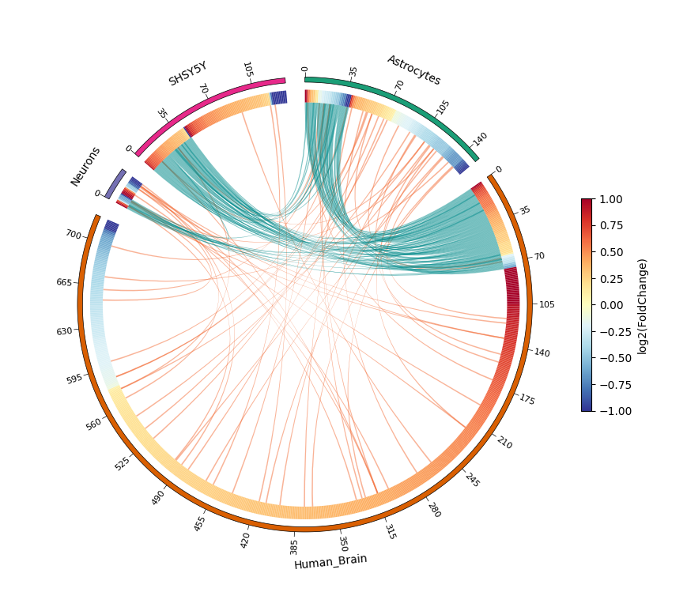

