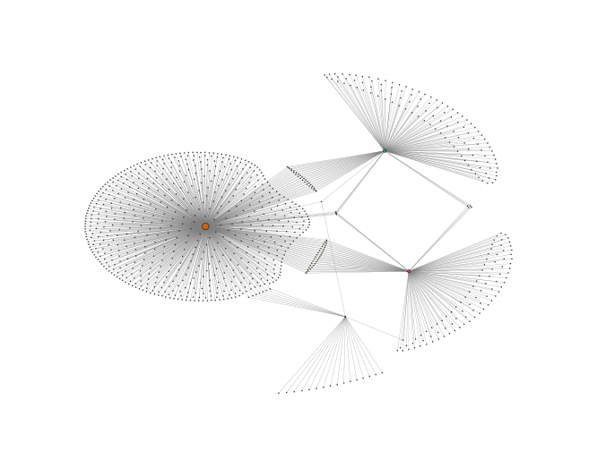

Nebula
======

Nebula is the module that allows multi-data integration and provides various functions for analyzing independent proteomics experiments. Thanks to the *General input workflow* performed by the OmicScope function, Nebula can also analyze multi-omics data.

To run the Nebula workflow, the input must be a folder containing .omics files that have been exported from the OmicScope and EnrichmentScope workflows.

Exporting **.omics** files - *object.savefile()*
--------------------------------------------------------

OmicScope and EnrichmentScope provide the **savefile function** for exporting *quantitative* data and *quantitative and enrichment data*\ , respectively. To export, simply call the savefile function and specify the folder path where the data will be saved.

.. code-block:: python

   # OmicScope Example
   import omicscope as omics

   df = omics.OmicScope('../tests/data/proteins/progenesis.xls', Method='Progenesis')
   df.savefile(PATH_TO_SAVE)

   # EnrichmentScope Example
   # Note: EnrichmentScope also includes QUANTITATIVE DATA
   enr = omics.EnrichmentScope(df)
   enr.savefile(PATH_TO_SAVE)

By default, the exported file name in OmicScope/EnrichmentScope is the condition extracted from the analysis. For instance, in the above example, the file name is 'COVID-CTRL.omics' since those are the conditions reported by the user.

.. code-block:: python

   df.Conditions

.. code-block::

   ['COVID', 'CTRL']

Nebula Object
=============

Nebula is capable of processing quantitative and enrichment data from .omics files. The experimental group is extracted from the .omics file, which can be modified by the user. This group is then used to name the respective experiment. Nebula reports the number of groups/experiments imported, their names, and whether enrichment data is included.

.. code-block:: python

   import omicscope as omics

   nebula = omics.Nebula('../tests/data/MultipleGroups/omics_file/')

.. code-block::

   You imported your data successfully!
           Data description:
           1. N groups imported: 4
           2. Groups: COVID,Covid_HB,NEURONS,SH_DIF
           3. N groups with enchment data: 4

The names for each group can also be changed in command line, as shown below:

.. code-block:: python

   nebula.groups = ['Astrocytes', 'Human_Brain', 'Neurons', 'SHSY5Y']
   nebula.groups

.. code-block::

   ['Astrocytes', 'Human_Brain', 'Neurons', 'SHSY5Y']

Figures and plots
=================

Barplot - *object.barplot()*
--------------------------------

The Nebula barplot displays quantified and differentially regulated proteins/genes across all studies. 

.. code-block:: python

   nebula.barplot(dpi=90)

.. image:: nebula_files/nebula_12_0.png
   :target: nebula_files/nebula_12_0.png
   :alt: png

Enrichment Dotplot - *object.dotplot_enrichment()*
------------------------------------------------------

If the ``.omics`` file contains enrichment results, users can compare the enrichment for each group using the ``dotplot_enrichment()`` function. By default, a list of the top 5 terms for each group is created according to p-value, and then used to filter each enrichment data to be compared.

.. code-block:: python

   nebula.dotplot_enrichment(top=20, dpi=90, fig_height=10)

.. image:: nebula_files/nebula_14_0.png
   :target: nebula_files/nebula_14_0.png
   :alt: png

Differentially regulated - *object.diff_reg()*
--------------------------------------------------

The comparison between groups can only be performed at differentially regulated levels, displaying the number of up-regulated and down-regulated proteins.

.. code-block:: python

   nebula.diff_reg(dpi=90)

.. image:: nebula_files/nebula_16_0.png
   :target: nebula_files/nebula_16_0.png
   :alt: png

Protein Overlap - *object.protein_overlap()*
------------------------------------------------

The Venn Diagram is a classic plot used to visualize the overlap and uniqueness between groups. However, several tools that quickly reproduce Venn diagrams (such as Interactive Venn) are limited in the number of groups that can be compared, since all geometric figures need to overlap one another.

Since it is not uncommon for proteomics studies to evaluate several groups, Nebula provides an alternative plot called the Upset Plot. In the Upset Plot, several groups can be compared at once. The lower-left barplot describes the number of entities associated with each group, while the upper-right barplot shows the intersection size for each comparison, which are highlighted in the colored and linked circles in the frame.

Nebula includes a protein overlap function that performs comparisons between all groups at the protein level.

.. code-block:: python

   nebula.protein_overlap(dpi=90)

.. image:: nebula_files/nebula_18_0.png
   :target: nebula_files/nebula_18_0.png
   :alt: png

Enrichment Overlap - *object.protein_overlap()*
---------------------------------------------------

Working in the same way that protein_overlap, enrichment_overlap performs the same visualization for enriched terms.

.. code-block:: python

   nebula.enrichment_overlap(dpi=90)

.. image:: nebula_files/nebula_20_0.png
   :target: nebula_files/nebula_20_0.png
   :alt: png

Similarity comparison
---------------------

To gain a better understanding of the similarity between different groups in terms of proteome or differentially regulated protein levels, Nebula calculates the distance between groups using the Jaccard index. However, users can choose to specify other metrics, such as correlation and Euclidean distance.

Heatmap - *object.similarity_heatmap()*
^^^^^^^^^^^^^^^^^^^^^^^^^^^^^^^^^^^^^^^^^^^

To make the data easier to visualize, Nebula plots the pair-wise comparison in a heatmap with hierarchical clustering.

.. code-block:: python

   nebula.similarity_heatmap(dpi=90, metric='jaccard')

.. image:: nebula_files/nebula_22_0.png
   :target: nebula_files/nebula_22_0.png
   :alt: png

Network - *object.similarity_network()*
^^^^^^^^^^^^^^^^^^^^^^^^^^^^^^^^^^^^^^^^^^^

Another option to visualize pairwise comparisons is to use a network. For this purpose, the user can still determine the cutoff for edge assignments.

.. code-block:: python

   nebula.similarity_network(pvalue=1, similarity_cutoff=0.3, dpi=90)

Fisher's test
-------------

To determine whether similarity across the groups can also be seen in statistical terms, Nebula applies a pairwise Fisher's exact test to return a p-value for the groups. Once again, the user can visualize the data with a heatmap and/or network.

Heatmap - *object.fisher_heatmap()*
---------------------------------------

A heatmap is plotted and colored based on nominal p-values, however, the labels are shown in the log10-scale.

.. code-block:: python

   nebula.fisher_heatmap(pvalue=1, dpi=90)

.. image:: nebula_files/nebula_26_0.png
   :target: nebula_files/nebula_26_0.png
   :alt: png

Group Network - *object.group_network()*
============================================

This function allows users to filter proteins based on a p-value (default: protein_pvalue=0.05), followed by a pairwise Fisher's exact test. Users can also filter the data for edges based on Fisher's p-value (default: graph_pvalue=0.05) to assign edges to the graph. The labels on the graph are shown in the log10-scale.

.. code-block:: python

   nebula.fisher_network(protein_pvalue=1, graph_pvalue=0.05, dpi=90)

.. image:: nebula_files/nebula_28_0.png
   :target: nebula_files/nebula_28_0.png
   :alt: png

Protein Network - *object.network()*
----------------------------------------

Network function provides an overview of individual proteins shared among groups and, using a systems biology approach, network theory can help find communities/modules and extract information based on similarities across the groups. As there are many programs specifically designed for plotting graphs and networks, Nebula exports all networks as a .graphml file, which can be imported into Cytoscape and other software designed for this purpose.

.. code-block:: python

   nebula.whole_network(dpi=90)

.. code-block::

   <networkx.classes.graph.Graph at 0x291e6be3090>

Circular graphs - *object.circular_path()*
----------------------------------------------

The circular plot was designed to compare groups that were enriched for a specific term based on their respective differentially regulated proteins. Furthermore, the proteins are plotted with their corresponding regulations, either up-regulated (in red) or down-regulated (in blue).

**NOTE**\ : To use circular_path, R must be installed and included in system Path. Additionally, maybe user must install manually circlize and jsonlite packages.

.. code-block:: python

   nebula.circular_path('Amyotrophic lateral sclerosis')

.. image:: nebula_files/nebula_32_0.png
   :target: nebula_files/nebula_32_0.png
   :alt: png

Circos plot - *object.circos_plot()*
----------------------------------------

Circos , a software designed for visualizing complex data, is used by Nebula to display proteomic data from multiple groups in a circular mode. Circos enables users to visualize proteins that are differentially regulated across multiple groups and highlights those that are shared among the groups with dark cyan links. The regulation of the proteins is displayed using an edge heatmap. If the .omics file contains enrichment analysis, the circos_plot function incorporates the shared enrichment terms (black links) to provide insight into the number of pathways shared between the groups.

**NOTE**\ : To use circos_plot, the system must have Perl installed and configured according to Circos software and the appropriate configuration for the system.

.. code-block:: python

   nebula.circos_plot()

.. image:: nebula_files/nebula_34_0.png
   :target: nebula_files/nebula_34_0.png
   :alt: png

