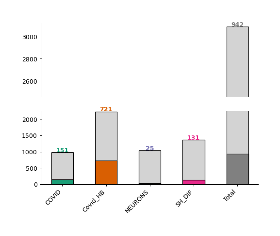
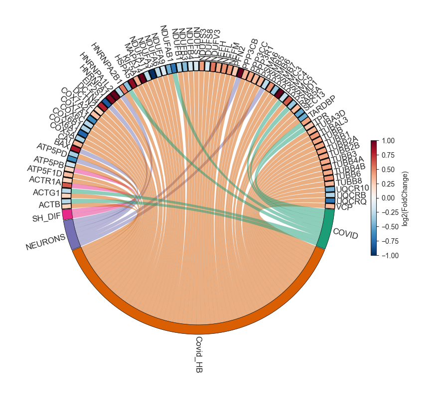

Nebula
======

`omics.Nebula() <https://omicscope.readthedocs.io/en/latest/reference/omicscope.html#omicscope.Nebula>`__

Nebula is the module that allows multi-data integration and provides
various functions for analyzing independent proteomics experiments.
Thanks to the `General and Snapshot input
workflows <https://omicscope.readthedocs.io/en/latest/input.html>`__
performed by OmicScope, Nebula can also analyze multiple datasets in a
multi-omics fashion.

Depending on the OmicScope environment you use Nebula, the method to
import can vary. While using the **OmicScope python package**, you must
insert all desired *.omics* files into a folder. On the other hand,
while using the **OmicScope Web application**, the same files must be
compressed in a *.zip* file and then uploaded.

In the sections above, we describe how to generate .omics files and
Nebula’s capabilities.

How to Make Nebula Input
------------------------

Exporting **.omics** Files - ``OmicScope.savefile()`` or ``EnrichmentScope.savefile()``
~~~~~~~~~~~~~~~~~~~~~~~~~~~~~~~~~~~~~~~~~~~~~~~~~~~~~~~~~~~~~~~~~~~~~~~~~~~~~~~~~~~~~~~

Both OmicScope and EnrichmentScope offer a convenient function,
``savefile``, for exporting *.omics* data. This function enables the
export of *quantitative data* from OmicScope and *quantitative and
enrichment data* from EnrichmentScope. Additionally, .omics files are
text files and the information can be accessed using notepad.

Using the OmicScope Web Application
^^^^^^^^^^^^^^^^^^^^^^^^^^^^^^^^^^^

When using the OmicScope web application, the .omics file is compressed
into a .zip file that can be downloaded at the end of the process.

-  Complete your analysis in the web application.
-  Navigate to the export section.
-  Download the .zip file containing your .omics data.

Using the OmicScope Python Package
^^^^^^^^^^^^^^^^^^^^^^^^^^^^^^^^^^

To export .omics files using the OmicScope Python package, simply invoke
the ``savefile`` function and specify the folder path where you want to
save the data. (code below)

.. code:: ipython3

    # OmicScope Example
    import omicscope as omics
    
    data = omics.OmicScope('../tests/data/proteins/progenesis.xls', Method='Progenesis')
    data.savefile(PATH_TO_SAVE)
    
    # EnrichmentScope Example
    # Note: EnrichmentScope also includes QUANTITATIVE DATA
    enr = omics.EnrichmentScope(data)
    enr.savefile(PATH_TO_SAVE)

Note: By default, the exported file name in OmicScope/EnrichmentScope is
derived from the conditions extracted during the analysis. For example,
if you analyzed data with conditions “COVID” and “CTRL,” the exported
file name would be ‘COVID-CTRL.omics’.

.. code:: ipython3

    data.Conditions

::

   ['COVID', 'CTRL']

Nebula Object
-------------

Nebula processes quantitative and enrichment data from .omics files,
labeling each study using the imported “experimental condition”. If two
or more .omics files present the same “experimental groups” labels,
Nebula adds a numerical suffix to differentiate each study
(recommendation: modify the experimental groups in the .omics file to
avoid this issue).

Since Nebula considers differentially regulated proteins to plot several
figures, While importing data into Nebula, users may also define a
p-value threshold (defaults to 0.05)

Nebula reports the number of imported groups/experiments, their names,
and whether enrichment data is included.

.. code:: ipython3

    import omicscope as omics
    
    nebula = omics.Nebula('../../tests/data/MultipleGroups/omics_file/')

.. parsed-literal::

    OmicScope v 1.4.0 For help: https://omicscope.readthedocs.io/en/latest/ or https://omicscope.ib.unicamp.brIf you use  in published research, please cite:
    'Reis-de-Oliveira, G., et al (2024). OmicScope unravels systems-level insights from quantitative proteomics data 
    
    You imported your data successfully!
            Data description:
            1. N groups imported: 4
            2. Groups: COVID,Covid_HB,NEURONS,SH_DIF
            3. N groups with enchment data: 4
            
    

*Note*: While using the OmicScope python package, the names/colors of
each group can be altered via the command line, granting users full
control over experiment identification (see below). When using the web
app, users can change names/colors using the sidebar.

.. code:: ipython3

    nebula.groups = ['Astrocytes', 'Human_Brain', 'Neurons', 'SHSY5Y']
    nebula.groups

Figures and plots
-----------------

Barplot - `object.barplot() <https://omicscope.readthedocs.io/en/latest/reference/nebulavis.html#omicscope.MultipleData.MultipleVisualization.barplot>`__
~~~~~~~~~~~~~~~~~~~~~~~~~~~~~~~~~~~~~~~~~~~~~~~~~~~~~~~~~~~~~~~~~~~~~~~~~~~~~~~~~~~~~~~~~~~~~~~~~~~~~~~~~~~~~~~~~~~~~~~~~~~~~~~~~~~~~~~~~~~~~~~~~~~~~~~~~

The Nebula barplot displays the number of quantified and differentially
regulated proteins/genes (y-axis) across all studies (x-axis).

**How to interpret**: Each bar represents a study imported into the
Nebula module. The colored (or dark gray) bars represent the number of
differentially regulated proteins in each respective study, with the
exact number displayed at the top of each bar. The light gray bars at
the top represent the number of quantified proteins in each experiment.

.. code:: ipython3

    nebula.barplot(dpi=90)

Enrichment Dotplot - `object.dotplot_enrichment() <https://omicscope.readthedocs.io/en/latest/reference/nebulavis.html#omicscope.MultipleData.MultipleVisualization.dotplot_enrichment>`__
~~~~~~~~~~~~~~~~~~~~~~~~~~~~~~~~~~~~~~~~~~~~~~~~~~~~~~~~~~~~~~~~~~~~~~~~~~~~~~~~~~~~~~~~~~~~~~~~~~~~~~~~~~~~~~~~~~~~~~~~~~~~~~~~~~~~~~~~~~~~~~~~~~~~~~~~~~~~~~~~~~~~~~~~~~~~~~~~~~~~~~~~~~

When your ``.omics`` files contain enrichment results, you can utilize
the ``dotplot_enrichment()`` function to compare the enrichment outcomes
from each imported study.

The function generates a list of the top N terms (by default N = 5) for
each imported study based on p-values. This list is then used to filter
each enrichment dataset for comparison.

**How to interpret**: Each dot represents a specific term, with the
color and size of the dot proportional to -log10(pAdjusted). This plot
is useful for identifying pathways shared among all groups or for noting
pathways that are unique to a specific condition compared to others.

.. code:: ipython3

    nebula.dotplot_enrichment(top=20, dpi=90, fig_height=10)

.. image:: nebula_files/nebula_14_0.png

Differentially Regulated - `object.diff_reg() <https://omicscope.readthedocs.io/en/latest/reference/nebulavis.html#omicscope.MultipleData.MultipleVisualization.diff_reg>`__
~~~~~~~~~~~~~~~~~~~~~~~~~~~~~~~~~~~~~~~~~~~~~~~~~~~~~~~~~~~~~~~~~~~~~~~~~~~~~~~~~~~~~~~~~~~~~~~~~~~~~~~~~~~~~~~~~~~~~~~~~~~~~~~~~~~~~~~~~~~~~~~~~~~~~~~~~~~~~~~~~~~~~~~~~~~~

In this plot, Nebula splits down- and up-regulated proteins (x-axis) in
each imported study (y-axis), and sizes each dot according to the number
of proteins in each condition.

**How to interpret**: The larger the dot, the higher the number of
proteins in that subset of data. This visualization helps to compare the
proportional sizes of up- and down-regulated proteins across different
studies.

.. code:: ipython3

    nebula.diff_reg(dpi=90)
    

Protein Overlap - `object.protein_overlap() <https://omicscope.readthedocs.io/en/latest/reference/nebulavis.html#omicscope.MultipleData.MultipleVisualization.protein_overlap>`__
~~~~~~~~~~~~~~~~~~~~~~~~~~~~~~~~~~~~~~~~~~~~~~~~~~~~~~~~~~~~~~~~~~~~~~~~~~~~~~~~~~~~~~~~~~~~~~~~~~~~~~~~~~~~~~~~~~~~~~~~~~~~~~~~~~~~~~~~~~~~~~~~~~~~~~~~~~~~~~~~~~~~~~~~~~~~~~~~~

The classic Venn Diagram is a common tool for visualizing overlap and
uniqueness between conditions. However, conventional Venn diagram tools
have limitations when dealing with multiple conditions due to
overlapping constraints. To overcome these limitations, Nebula offers
Upset plots to evaluate overlaps at the protein and enrichment levels.

**How to interpret an Upset plot**: This plot allows for the comparison
of multiple studies simultaneously. The lower bar plot presents the
number of entities associated with each group. The upper bar plot
reveals the intersection size for each comparison, visually represented
by colored and linked circles within the frame. A useful approach is to
look for comparisons of interest in the frame and then refer to the top
bar to see the number of proteins uniquely present in that comparison.

Upset plot - Protein Level
^^^^^^^^^^^^^^^^^^^^^^^^^^

.. code:: ipython3

    nebula.protein_overlap(dpi=90)

.. image:: nebula_files/nebula_18_0.png

Upset plot - Enrichment Level - `object.enrichment_overlap() <https://omicscope.readthedocs.io/en/latest/reference/nebulavis.html#omicscope.MultipleData.MultipleVisualization.enrichment_overlap>`__
^^^^^^^^^^^^^^^^^^^^^^^^^^^^^^^^^^^^^^^^^^^^^^^^^^^^^^^^^^^^^^^^^^^^^^^^^^^^^^^^^^^^^^^^^^^^^^^^^^^^^^^^^^^^^^^^^^^^^^^^^^^^^^^^^^^^^^^^^^^^^^^^^^^^^^^^^^^^^^^^^^^^^^^^^^^^^^^^^^^^^^^^^^^^^^^^^^^^^

.. code:: ipython3

    nebula.enrichment_overlap(dpi=90)

Similarity Analysis
~~~~~~~~~~~~~~~~~~~

When analyzing multiple groups, a common question is whether there is a
metric to evaluate the similarity between studies in a pair-wise
fashion. To address this, Nebula calculates similarity indices between
imported studies at the protein level.

By default, Nebula performs Jaccard Similarity analysis using proteins
present in each respective study. Additionally, users can select other
algorithms to calculate distances, such as Pearson and Euclidean, which
also consider protein fold-changes to obtain similarity indices.

The results of this analysis are displayed using two approaches: heatmap
and network. In the heatmap analysis, all the similarity indices are
shown, along with a hierarchical clustering approach to define which
studies are closest together. Conversely, the network strategy uses the
same results but applies a similarity index cutoff to establish links
between studies, offering an alternative and cleaner visualization of
results.

Heatmap - `object.similarity_heatmap() <https://omicscope.readthedocs.io/en/latest/reference/nebulavis.html#omicscope.MultipleData.MultipleVisualization.similarity_heatmap>`__
^^^^^^^^^^^^^^^^^^^^^^^^^^^^^^^^^^^^^^^^^^^^^^^^^^^^^^^^^^^^^^^^^^^^^^^^^^^^^^^^^^^^^^^^^^^^^^^^^^^^^^^^^^^^^^^^^^^^^^^^^^^^^^^^^^^^^^^^^^^^^^^^^^^^^^^^^^^^^^^^^^^^^^^^^^^^^^^

**How to interpret**: The heatmap color-codes the similarity index, with
stronger colors indicating higher index values. A higher index value
indicates greater similarity between the two evaluated groups.
Additionally, hierarchical clustering is performed to enhance the
visualization of groups that exhibit greater similarities.

.. code:: ipython3

    nebula.similarity_heatmap(dpi=90, metric='jaccard')
    

Network - `object.similarity_network() <https://omicscope.readthedocs.io/en/latest/reference/nebulavis.html#omicscope.MultipleData.MultipleVisualization.similarity_network>`__
^^^^^^^^^^^^^^^^^^^^^^^^^^^^^^^^^^^^^^^^^^^^^^^^^^^^^^^^^^^^^^^^^^^^^^^^^^^^^^^^^^^^^^^^^^^^^^^^^^^^^^^^^^^^^^^^^^^^^^^^^^^^^^^^^^^^^^^^^^^^^^^^^^^^^^^^^^^^^^^^^^^^^^^^^^^^^^^

**How to interpret**: In the network representation of the similarity
analysis, nodes represent imported studies, while links are established
based on a similarity index cutoff. The width of the links is also
proportional to the index value.

.. code:: ipython3

    nebula.similarity_network(pvalue=1, absolute_similarity_cutoff=0.3, dpi=90)

.. image:: nebula_files/nebula_24_0.png

Statistical Test
~~~~~~~~~~~~~~~~

Nebula introduces a statistical assessment to determine if the
similarity observed across groups is statistically significant. By
applying Fisher’s exact test, the statistical principles used in this
analysis are similar to those employed in an Over-Representation
Analysis (ORA).

Users have the flexibility to specify a background against which the
analysis is conducted. By default, Nebula considers all imported
proteins/genes as the background. However, users have the option to
define a specific number of genes as the background. For example, users
may choose to use the number of reviewed proteins in the Human Proteome
database as their defined background for the analysis. This level of
customization allows for more precise and context-specific analyses.

Other Statistical Analyses
^^^^^^^^^^^^^^^^^^^^^^^^^^

While using Nebula’s statistical workflow, users can specify alternative
methods for performing statistical comparisons. The available options
include t-test, Wilcoxon, and Kolmogorov-Smirnov tests. All tests use
fold changes from proteins overlapping between pair-wise studies to
compute distributions and perform statistical analysis. In these tests,
the null hypothesis is that pair-wise studies are similar, and it is
rejected if the p-value is lower than a threshold (0.05 by default).

**How to interpret**: For Fisher’s exact test, two groups are
statistically similar if the p-values are <= 0.05. For other statistical
approaches, two groups are considered similar if the p-values are >
0.05.

Heatmap - `object.stat_heatmap() <https://omicscope.readthedocs.io/en/latest/reference/nebulavis.html#omicscope.MultipleData.MultipleVisualization.stat_heatmap>`__
^^^^^^^^^^^^^^^^^^^^^^^^^^^^^^^^^^^^^^^^^^^^^^^^^^^^^^^^^^^^^^^^^^^^^^^^^^^^^^^^^^^^^^^^^^^^^^^^^^^^^^^^^^^^^^^^^^^^^^^^^^^^^^^^^^^^^^^^^^^^^^^^^^^^^^^^^^^^^^^^^^^

**How to interpret**: The heatmap color-codes the p-values. For Fisher’s
exact test, two groups are statistically similar if the p-values are <=
0.05. For other statistical approaches, two groups are similar if the
p-values are > 0.05.

.. code:: ipython3

    nebula.stat_heatmap(pvalue=1, dpi=90)

.. image:: nebula_files/nebula_26_0.png

Statistical Network - `object.stat_network() <https://omicscope.readthedocs.io/en/latest/reference/nebulavis.html#omicscope.MultipleData.MultipleVisualization.stat_network>`__
^^^^^^^^^^^^^^^^^^^^^^^^^^^^^^^^^^^^^^^^^^^^^^^^^^^^^^^^^^^^^^^^^^^^^^^^^^^^^^^^^^^^^^^^^^^^^^^^^^^^^^^^^^^^^^^^^^^^^^^^^^^^^^^^^^^^^^^^^^^^^^^^^^^^^^^^^^^^^^^^^^^^^^^^^^^^^^^

**How to interpret**: In the network representation of the statistical
analysis, nodes represent imported studies, while links are established
based on a similarity index cutoff. The width of the links is also
proportional to the -log(pvalue).

*Note*: This function empowers users to filter proteins based on a
specific p-value threshold (default: ``protein_pvalue=0.05``). Users can
also customize edge filtering based on obtained p-value (default:
``graph_pvalue=0.05``) to assign edges to the graph. The graph’s labels
are displayed in the log10 scale.

.. code:: ipython3

    nebula.stat_network(protein_pvalue=1, graph_pvalue=0.05, dpi=90)

Protein Network - `object.whole_network() <https://omicscope.readthedocs.io/en/latest/reference/nebulavis.html#omicscope.MultipleData.MultipleVisualization.whole_network>`__
~~~~~~~~~~~~~~~~~~~~~~~~~~~~~~~~~~~~~~~~~~~~~~~~~~~~~~~~~~~~~~~~~~~~~~~~~~~~~~~~~~~~~~~~~~~~~~~~~~~~~~~~~~~~~~~~~~~~~~~~~~~~~~~~~~~~~~~~~~~~~~~~~~~~~~~~~~~~~~~~~~~~~~~~~~~~~

The network function in Nebula provides an insightful overview of
individual proteins shared among groups. Each study is linked with
differentially regulated proteins, enabling easy visualization of
proteins shared among imported outcomes. This network can be exported as
.graphml files, allowing for network visualization in third-party
software to perform systems biology analysis.

.. code:: ipython3

    nebula.whole_network(dpi=90)

.. image:: nebula_files/nebula_30_0.png

.. parsed-literal::

    <networkx.classes.graph.Graph at 0x182060adad0>

Circular Graphs - `object.circular_term() <https://omicscope.readthedocs.io/en/latest/reference/nebulavis.html#omicscope.MultipleData.MultipleVisualization.circular_term>`__
~~~~~~~~~~~~~~~~~~~~~~~~~~~~~~~~~~~~~~~~~~~~~~~~~~~~~~~~~~~~~~~~~~~~~~~~~~~~~~~~~~~~~~~~~~~~~~~~~~~~~~~~~~~~~~~~~~~~~~~~~~~~~~~~~~~~~~~~~~~~~~~~~~~~~~~~~~~~~~~~~~~~~~~~~~~~~

This plot integrates three levels of information: imported studies,
protein details, and enrichment outcomes. Upon selecting a target
enrichment term, Nebula generates a circular diagram that links all
conditions with proteins associated with the enriched term, displaying
the protein fold change for those groups.

**How to interpret**: Each displayed protein is involved in the
pathway/biological process/etc. chosen by the user. The diagram connects
the groups where the protein exhibits differential regulation, while
also highlighting the fold change in each group.

.. code:: ipython3

    nebula.circular_term('Amyotrophic lateral sclerosis')

Circos plot - `object.circos_plot() <https://omicscope.readthedocs.io/en/latest/reference/nebulavis.html#omicscope.MultipleData.MultipleVisualization.circos_plot>`__
~~~~~~~~~~~~~~~~~~~~~~~~~~~~~~~~~~~~~~~~~~~~~~~~~~~~~~~~~~~~~~~~~~~~~~~~~~~~~~~~~~~~~~~~~~~~~~~~~~~~~~~~~~~~~~~~~~~~~~~~~~~~~~~~~~~~~~~~~~~~~~~~~~~~~~~~~~~~~~~~~~~~~

Circos allows users to visualize differentially regulated proteins
across multiple groups and highlights shared proteins with dark cyan
links. The regulation of the proteins is depicted using an edge heatmap.
If the .omics file contains enrichment analysis, the circos_plot
function incorporates shared enrichment terms with orange links,
offering insights into the number of pathways shared between groups.

.. code:: ipython3

    nebula.circos_plot(colorenrichment='#F56A33', linewidth_heatmap=0)

.. image:: nebula_files/nebula_34_0.png

