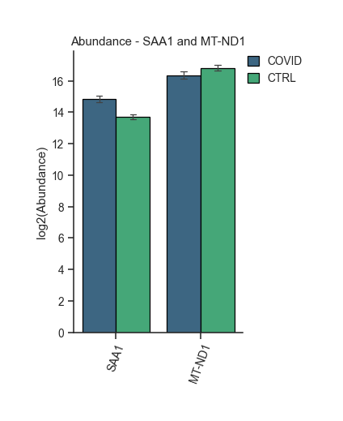
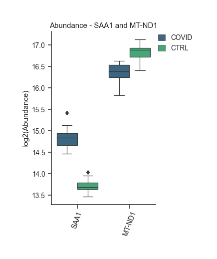
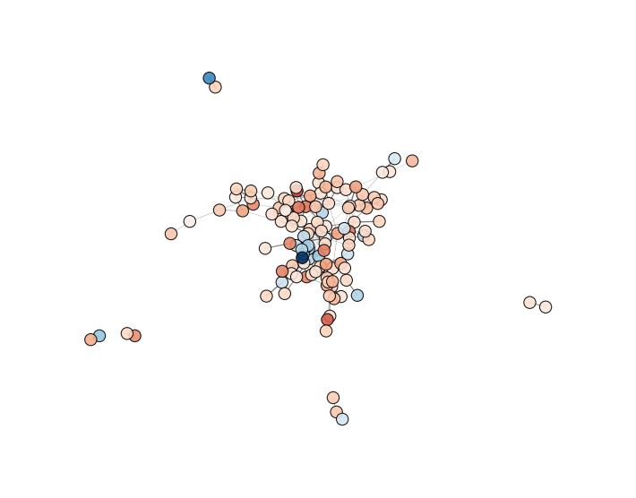

.. code-block:: python

   import sys
   sys.path.insert(1, 'C:/Users/gui_d/omicscope/omicscope/src/')

Overview of OmicScope
---------------------

This section provides an overview of the functionalities of the OmicScope module, including instructions on how to use the OmicScope package to extract biological information.

OmicScope Object
^^^^^^^^^^^^^^^^

After importing data into OmicScope, users can access both the input parameters and the resulting data.

.. code-block:: python

   import omicscope as omics

   data = omics.OmicScope('../../tests/data/proteins/progenesis.xls', Method = 'Progenesis', ControlGroup = 'CTRL')

.. code-block::

   OmicScope v 1.4.0 For help: https://omicscope.readthedocs.io/en/latest/ or https://omicscope.ib.unicamp.brIf you use  in published research, please cite:
   'Reis-de-Oliveira, G., et al (2024). OmicScope unravels systems-level insights from quantitative proteomics data 

   User already performed statistical analysis
   OmicScope identifies: 697 deregulations

OmicScope records all steps in *Object.Params*\ , allowing users to document results and save all parameters utilized in the analysis.

.. code-block:: python

   import pandas as pd 

   # user can display using dictionary or pandas dataframe
   print(data.Params)

   pd.DataFrame(data.Params)

.. code-block::

   {'Params': {'ImportMethod': 'Progenesis', 'ImportWarning_1': 'Quantification using Normalized Abundance', 'Stats': 'Imported from user data', 'Stats_Warning1': 'Only 1 experimental group identified', 'Stats_Warning_2': 'Drop protein contaminants based on Frankenfield, 2022'}}

.. raw:: html

   

   
   <table border="1" class="dataframe">
     <thead>
       <tr style="text-align: right;">
         <th></th>
         <th>Params</th>
       </tr>
     </thead>
     <tbody>
       <tr>
         <th>ImportMethod</th>
         <td>Progenesis</td>
       </tr>
       <tr>
         <th>ImportWarning_1</th>
         <td>Quantification using Normalized Abundance</td>
       </tr>
       <tr>
         <th>Stats</th>
         <td>Imported from user data</td>
       </tr>
       <tr>
         <th>Stats_Warning1</th>
         <td>Only 1 experimental group identified</td>
       </tr>
       <tr>
         <th>Stats_Warning_2</th>
         <td>Drop protein contaminants based on Frankenfiel...</td>
       </tr>
     </tbody>
   </table>
   

Conditions
----------

Users can access the conditions evaluated during proteomics experiments by using the following code:

.. code-block:: python

   data.Conditions

.. code-block::

   ['CTRL', 'COVID']

In the example above, two groups ("CTRL" and "COVID") were identified as conditions.

By default, OmicScope sorts conditions in alphabetical order and selects the first one to be considered the "Control Group," which is crucial for some plots (such as the volcano plot). However, in the data analyzed here, we defined ``ControlGroup`` as 'CTRL' to fit scientific purposes. The ``ControlGroup``\ , whether user-defined or OmicScope-defined, can be accessed through ``object.ControlGroup`` (see below).

.. code-block:: python

   data.ControlGroup

.. code-block::

   'CTRL'

Differential Expression Analysis
--------------------------------

Differential expression analysis in OmicScope generates results stored in the ``quant_data`` object. This tabular data combines results from the assay (\ ``object.expression``\ ), pdata (\ ``object.pdata``\ ), and rdata (\ ``object.rdata``\ ).

Consequently, ``quant_data`` includes information about quantified proteins, such as identification results, gene names, p-values, adjusted p-values, abundance in each sample, mean abundance in each group, and fold-change.

.. code-block:: python

   data.quant_data.head()

.. raw:: html

   

   
   <table border="1" class="dataframe">
     <thead>
       <tr style="text-align: right;">
         <th></th>
         <th>Accession</th>
         <th>Peptide count</th>
         <th>Unique peptides</th>
         <th>Confidence score</th>
         <th>pvalue</th>
         <th>pAdjusted</th>
         <th>Max fold change</th>
         <th>Power</th>
         <th>Highest mean condition</th>
         <th>Lowest mean condition</th>
         <th>...</th>
         <th>VCC_HB_F_1.CTRL</th>
         <th>VCC_HB_F_1_2.CTRL</th>
         <th>VCC_HB_G_1.CTRL</th>
         <th>VCC_HB_G_1_2.CTRL</th>
         <th>TotalMean</th>
         <th>mean CTRL</th>
         <th>mean COVID</th>
         <th>fc</th>
         <th>log2(fc)</th>
         <th>-log10(pAdjusted)</th>
       </tr>
     </thead>
     <tbody>
       <tr>
         <th>0</th>
         <td>P0DJI8</td>
         <td>1</td>
         <td>1</td>
         <td>6.8809</td>
         <td>0.000000e+00</td>
         <td>0.000000</td>
         <td>2.192654</td>
         <td>1.000000</td>
         <td>COVID</td>
         <td>CTRL</td>
         <td>...</td>
         <td>12731.691404</td>
         <td>13233.853968</td>
         <td>15059.764993</td>
         <td>12423.510364</td>
         <td>2.387711e+04</td>
         <td>13618.731398</td>
         <td>2.986117e+04</td>
         <td>2.192654</td>
         <td>1.132678</td>
         <td>inf</td>
       </tr>
       <tr>
         <th>2</th>
         <td>P03886</td>
         <td>3</td>
         <td>0</td>
         <td>24.0213</td>
         <td>1.299387e-07</td>
         <td>0.000041</td>
         <td>1.386199</td>
         <td>0.999998</td>
         <td>CTRL</td>
         <td>COVID</td>
         <td>...</td>
         <td>122412.705135</td>
         <td>115490.657307</td>
         <td>136493.069796</td>
         <td>143254.473213</td>
         <td>9.672463e+04</td>
         <td>117378.518567</td>
         <td>8.467654e+04</td>
         <td>0.721397</td>
         <td>-0.471134</td>
         <td>4.390512</td>
       </tr>
       <tr>
         <th>3</th>
         <td>Q9BSM1</td>
         <td>2</td>
         <td>2</td>
         <td>12.2670</td>
         <td>5.516988e-07</td>
         <td>0.000105</td>
         <td>1.726615</td>
         <td>0.999984</td>
         <td>COVID</td>
         <td>CTRL</td>
         <td>...</td>
         <td>16792.299671</td>
         <td>17921.537559</td>
         <td>21259.563932</td>
         <td>23265.526938</td>
         <td>3.388698e+04</td>
         <td>23227.525099</td>
         <td>4.010499e+04</td>
         <td>1.726615</td>
         <td>0.787946</td>
         <td>3.979791</td>
       </tr>
       <tr>
         <th>4</th>
         <td>O94819</td>
         <td>32</td>
         <td>16</td>
         <td>190.5708</td>
         <td>5.575815e-07</td>
         <td>0.000105</td>
         <td>1.245223</td>
         <td>0.999984</td>
         <td>COVID</td>
         <td>CTRL</td>
         <td>...</td>
         <td>770950.278605</td>
         <td>798518.655465</td>
         <td>847853.002726</td>
         <td>836297.424534</td>
         <td>1.025731e+06</td>
         <td>888172.927691</td>
         <td>1.105973e+06</td>
         <td>1.245223</td>
         <td>0.316404</td>
         <td>3.979791</td>
       </tr>
       <tr>
         <th>5</th>
         <td>Q14894</td>
         <td>17</td>
         <td>8</td>
         <td>146.9671</td>
         <td>7.825126e-07</td>
         <td>0.000111</td>
         <td>1.451950</td>
         <td>0.999974</td>
         <td>COVID</td>
         <td>CTRL</td>
         <td>...</td>
         <td>477789.148751</td>
         <td>479162.075245</td>
         <td>557800.495276</td>
         <td>576637.794756</td>
         <td>6.018212e+05</td>
         <td>468182.298998</td>
         <td>6.797772e+05</td>
         <td>1.451950</td>
         <td>0.537992</td>
         <td>3.953746</td>
       </tr>
     </tbody>
   </table>
   
5 rows × 56 columns

   

The code below demonstrates all the information available in ``quant_data`` for this specific dataset.

Please note that each import method (See Input page) incorporates specific features associated with the outputs from the respective identification and quantitation software.

.. code-block:: python

   data.quant_data.columns

.. code-block::

   Index(['Accession', 'Peptide count', 'Unique peptides', 'Confidence score',
          'pvalue', 'pAdjusted', 'Max fold change', 'Power',
          'Highest mean condition', 'Lowest mean condition', 'Description',
          'gene_name', 'VCC_HB_1_1_2020.COVID', 'VCC_HB_1_2.COVID',
          'VCC_HB_2_1.COVID', 'VCC_HB_2_1_2.COVID', 'VCC_HB_3_1.COVID',
          'VCC_HB_3_1_2.COVID', 'VCC_HB_4_1.COVID', 'VCC_HB_4_1_2.COVID',
          'VCC_HB_5_1.COVID', 'VCC_HB_5_1_2.COVID', 'VCC_HB_6_1.COVID',
          'VCC_HB_6_1_2.COVID', 'VCC_HB_7_1.COVID', 'VCC_HB_7_1_2.COVID',
          'VCC_HB_8_1.COVID', 'VCC_HB_8_1_2.COVID', 'VCC_HB_9_1.COVID',
          'VCC_HB_9_1_2.COVID', 'VCC_HB_10_1.COVID', 'VCC_HB_10_1_2_.COVID',
          'VCC_HB_11_1.COVID', 'VCC_HB_11_1_2_.COVID', 'VCC_HB_12_1.COVID',
          'VCC_HB_12_1_2_.COVID', 'VCC_HB_A_1.CTRL', 'VCC_HB_A_1_2.CTRL',
          'VCC_HB_B_1.CTRL', 'VCC_HB_B_1_2.CTRL', 'VCC_HB_C_1.CTRL',
          'VCC_HB_C_1_2.CTRL', 'VCC_HB_D_1.CTRL', 'VCC_HB_D_1_2.CTRL',
          'VCC_HB_E_1.CTRL', 'VCC_HB_E_1_2.CTRL', 'VCC_HB_F_1.CTRL',
          'VCC_HB_F_1_2.CTRL', 'VCC_HB_G_1.CTRL', 'VCC_HB_G_1_2.CTRL',
          'TotalMean', 'mean CTRL', 'mean COVID', 'fc', 'log2(fc)',
          '-log10(pAdjusted)'],
         dtype='object', name=0)

A more concise dataset, containing only differentially regulated proteins, can be found in ``object.deps``.

.. code-block:: python

   data.deps

.. raw:: html

   

   
   <table border="1" class="dataframe">
     <thead>
       <tr style="text-align: right;">
         <th></th>
         <th>gene_name</th>
         <th>Accession</th>
         <th>pAdjusted</th>
         <th>-log10(pAdjusted)</th>
         <th>log2(fc)</th>
       </tr>
     </thead>
     <tbody>
       <tr>
         <th>0</th>
         <td>SAA1</td>
         <td>P0DJI8</td>
         <td>0.000000</td>
         <td>inf</td>
         <td>1.132678</td>
       </tr>
       <tr>
         <th>2</th>
         <td>MT-ND1</td>
         <td>P03886</td>
         <td>0.000041</td>
         <td>4.390512</td>
         <td>-0.471134</td>
       </tr>
       <tr>
         <th>3</th>
         <td>PCGF1</td>
         <td>Q9BSM1</td>
         <td>0.000105</td>
         <td>3.979791</td>
         <td>0.787946</td>
       </tr>
       <tr>
         <th>4</th>
         <td>KBTBD11</td>
         <td>O94819</td>
         <td>0.000105</td>
         <td>3.979791</td>
         <td>0.316404</td>
       </tr>
       <tr>
         <th>5</th>
         <td>CRYM</td>
         <td>Q14894</td>
         <td>0.000111</td>
         <td>3.953746</td>
         <td>0.537992</td>
       </tr>
       <tr>
         <th>...</th>
         <td>...</td>
         <td>...</td>
         <td>...</td>
         <td>...</td>
         <td>...</td>
       </tr>
       <tr>
         <th>730</th>
         <td>NDUFAF4</td>
         <td>Q9P032</td>
         <td>0.049305</td>
         <td>1.307110</td>
         <td>-0.309369</td>
       </tr>
       <tr>
         <th>731</th>
         <td>HPCAL1</td>
         <td>P37235</td>
         <td>0.049335</td>
         <td>1.306847</td>
         <td>0.273795</td>
       </tr>
       <tr>
         <th>732</th>
         <td>METTL7A</td>
         <td>Q9H8H3</td>
         <td>0.049393</td>
         <td>1.306333</td>
         <td>0.432424</td>
       </tr>
       <tr>
         <th>733</th>
         <td>NDEL1</td>
         <td>Q9GZM8</td>
         <td>0.049710</td>
         <td>1.303558</td>
         <td>0.191609</td>
       </tr>
       <tr>
         <th>734</th>
         <td>TKFC</td>
         <td>Q3LXA3</td>
         <td>0.049777</td>
         <td>1.302972</td>
         <td>0.248767</td>
       </tr>
     </tbody>
   </table>
   
697 rows × 5 columns

   

Plots and Figures
-----------------

Plots and figures play crucial roles in the OmicScope workflow, aiding in data visualization and providing insights into proteomics datasets. The OmicScope figures toolset empowers researchers to assess data normalization, explore specific proteins, conduct clustering analysis, examine time course experiments, and investigate protein-protein interactions.

All plot functions offer numerous visualization parameters, enabling users to customize plots and generate figures ready for publication. Additionally, several functions allow users to highlight or select proteins of interest for plotting. To do so, simply specify the protein's gene name at the beginning of the function call. Furthermore, OmicScope provides color palette options based on the recommendations of the `Matplotlib package <https://matplotlib.org/stable/tutorials/colors/colormaps.html>`_.

Moreover, for plots requiring data processing (such as heatmaps, PCA, etc.), users can adjust certain metrics to obtain better results.

Finally, all figures generated by OmicScope can be saved using the ``save`` parameter (\ ``save = "PATH_OF_FOLDER_TO_SAVE"``\ ), either as vector graphics (with the ``.svg`` extension, using ``vector=True``\ ) or as static images (with the ``.png`` extension, using ``vector=False``\ ). By default, the resolution is set to 300 dpi (\ ``dpi=300``\ ).

Please refer below for each plot generated by OmicScope.

General Figures
^^^^^^^^^^^^^^^

Identification Barplot - `\ ``object.bar_ident()`` <https://omicscope.readthedocs.io/en/latest/reference/generalvisualization.html#omicscope.General.GeneralVisualization.bar_ident>`_
~~~~~~~~~~~~~~~~~~~~~~~~~~~~~~~~~~~~~~~~~~~~~~~~~~~~~~~~~~~~~~~~~~~~~~~~~~~~~~~~~~~~~~~~~~~~~~~~~~~~~~~~~~~~~~~~~~~~~~~~~~~~~~~~~~~~~~~~~~~~~~~~~~~~~~~~~~~~~~~~~~~~~~~~~~~~~~~~~~~~~~~~~~~~

The ``bar_ident()`` function generates a bar plot displaying the number of quantified proteins and differentially regulated proteins in the experiment. It can perform a log-transformation of the y-axis for better visualization.

**How to Interpret**\ : This plot provides an initial overview of the data, allowing you to evaluate the proportion of differentially regulated proteins in relation to the whole proteome analyzed.

.. code-block:: python

   data.bar_ident(logscale=True, dpi = 90)

.. code-block::

   <AxesSubplot: title={'left': 'CTRL vs COVID'}, ylabel='#Proteins'>

Dynamic Range Plot - `\ ``object.DynamicRange()`` <https://omicscope.readthedocs.io/en/latest/reference/generalvisualization.html#omicscope.General.GeneralVisualization.DynamicRange>`_
~~~~~~~~~~~~~~~~~~~~~~~~~~~~~~~~~~~~~~~~~~~~~~~~~~~~~~~~~~~~~~~~~~~~~~~~~~~~~~~~~~~~~~~~~~~~~~~~~~~~~~~~~~~~~~~~~~~~~~~~~~~~~~~~~~~~~~~~~~~~~~~~~~~~~~~~~~~~~~~~~~~~~~~~~~~~~~~~~~~~~~~~~~~~~~

The Dynamic Range plot is a classic in proteomics studies. It ranks proteins by abundance on a log-scale (x-axis) and plots them along the y-axis.

In the function below, it is possible to annotate proteins of interest in the plot by adding their ``gene_name`` as ``args``.

**How to Interpret**\ : This plot can highlight proteome coverage and suggest proteins with low abundance (bottom-left side of the plot) or high abundance (top-right side of the plot). 

This plot helps users investigate experimental issues and determine if proteins of interest are present in low or high abundance. In proteomics, low abundance is often associated with missing values, greater variation in abundance, and challenges in performing statistical analyses.

.. code-block:: python

   data.DynamicRange('SAA1', 'MT-ND1',dpi = 90)

.. image:: 3_omicscope_files/3_omicscope_19_0.png
   :target: 3_omicscope_files/3_omicscope_19_0.png
   :alt: png

Volcano Plot - `\ ``object.volcano()`` <https://omicscope.readthedocs.io/en/latest/reference/generalvisualization.html#omicscope.General.GeneralVisualization.volcano>`_
~~~~~~~~~~~~~~~~~~~~~~~~~~~~~~~~~~~~~~~~~~~~~~~~~~~~~~~~~~~~~~~~~~~~~~~~~~~~~~~~~~~~~~~~~~~~~~~~~~~~~~~~~~~~~~~~~~~~~~~~~~~~~~~~~~~~~~~~~~~~~~~~~~~~~~~~~~~~~~~~~~~~~~~~~~~~~~

The volcano plot is another scatter plot commonly used in proteomics experiments. In this plot, each protein is represented with log-transformed statistical values (e.g., p-value or adjusted p-value) on the y-axis and log2-transformed fold change on the x-axis.

When evaluating two groups, OmicScope generates a conventional volcano plot, displaying positive (up-regulated) and negative (down-regulated) proteins on the x-axis. For comparisons involving more groups, OmicScope shows only positive fold changes, labeling different groups and comparisons performed.

**How to Interpret**\ : This plot allows users to assess the magnitude and statistical significance of the differences between groups at proteome level. The farther a protein is from the origin of the plot, the greater the significance of its difference between groups. In addition to highlighting differentially regulated proteins, the plot serves as a proxy for quality control of normalization methods, as the data should exhibit a normal distribution on the x-axis and a positively skewed distribution on the y-axis.

.. code-block:: python

   data.volcano('SAA1', 'MT-ND1',dpi = 96)

.. image:: 3_omicscope_files/3_omicscope_21_0.png
   :target: 3_omicscope_files/3_omicscope_21_0.png
   :alt: png

MA Plot - `\ ``object.MAplot()`` <https://omicscope.readthedocs.io/en/latest/reference/generalvisualization.html#omicscope.General.GeneralVisualization.MAplot>`_
~~~~~~~~~~~~~~~~~~~~~~~~~~~~~~~~~~~~~~~~~~~~~~~~~~~~~~~~~~~~~~~~~~~~~~~~~~~~~~~~~~~~~~~~~~~~~~~~~~~~~~~~~~~~~~~~~~~~~~~~~~~~~~~~~~~~~~~~~~~~~~~~~~~~~~~~~~~~~~~~~~~~~~~

The Moving-Average plot (MA plot) is a scatter plot that assigns each protein its log-transformed abundance (y-axis) and log-transformed fold change (x-axis). In OmicScope, differentially regulated proteins are color-coded accordingly. This plot combines the information from both the volcano plot and the dynamic range plot, providing an alternative visualization strategy.

**How to Interpret**\ : This plot helps users evaluate data normalization. It is generally expected that only a few proteins (colored) will exhibit significant changes in expression. High deviations from zero on the y-axis may indicate that the data requires an alternative normalization method.

.. code-block:: python

   data.MAplot('SAA1', 'MT-ND1', dpi=96)

.. image:: 3_omicscope_files/3_omicscope_23_0.png
   :target: 3_omicscope_files/3_omicscope_23_0.png
   :alt: png

Normalization Boxplot - `\ ``object.normalization_boxplot()`` <https://omicscope.readthedocs.io/en/latest/reference/generalvisualization.html#omicscope.General.GeneralVisualization.normalization_boxplot>`_
~~~~~~~~~~~~~~~~~~~~~~~~~~~~~~~~~~~~~~~~~~~~~~~~~~~~~~~~~~~~~~~~~~~~~~~~~~~~~~~~~~~~~~~~~~~~~~~~~~~~~~~~~~~~~~~~~~~~~~~~~~~~~~~~~~~~~~~~~~~~~~~~~~~~~~~~~~~~~~~~~~~~~~~~~~~~~~~~~~~~~~~~~~~~~~~~~~~~~~~~~~~~~~~~~~~

Normalizing data is a pivotal step in differential proteomics experiments. Therefore, OmicScope also generates boxplots of protein abundance distribution (y-axis) across samples (x-axis).

**How to Interpret**\ : This plot helps users assess data normalization performed prior differential proteomics analysis. It is expected that samples will present similar mean abundances and error ranges. If this does not occur, users should consider trying alternative normalization methods and/or excluding potential sample outliers before performing differential proteomics analysis again.

.. code-block:: python

   data.normalization_boxplot(dpi=90)

Evaluate Abundance of a Subset of Proteins
^^^^^^^^^^^^^^^^^^^^^^^^^^^^^^^^^^^^^^^^^^

OmicScope offers two options for visualizing individual proteins: barplots and boxplots. Both functions work similarly, allowing users to specify target proteins and plot their abundances (y-axis) across groups (x-axis). The result is a single figure encompassing all selected proteins and their respective conditions, with the option of performing log-transformation of protein abundance.

**How to Interpret**\ : Barplots and boxplots are used to compare protein abundance across groups, enabling users to evaluate mean abundance along with respective errors and data distribution. These plots are particularly useful for searching specific targets in an attempt to validate findings or conduct in-depth investigations.

Bar plot of proteins - `\ ``object.bar_protein(args)`` <https://omicscope.readthedocs.io/en/latest/reference/generalvisualization.html#omicscope.General.GeneralVisualization.bar_protein>`_
~~~~~~~~~~~~~~~~~~~~~~~~~~~~~~~~~~~~~~~~~~~~~~~~~~~~~~~~~~~~~~~~~~~~~~~~~~~~~~~~~~~~~~~~~~~~~~~~~~~~~~~~~~~~~~~~~~~~~~~~~~~~~~~~~~~~~~~~~~~~~~~~~~~~~~~~~~~~~~~~~~~~~~~~~~~~~~~~~~~~~~~~~~~~~~~~~~

In the protein bar plot, OmicScope considers the mean as the estimator and adds error bars representing the standard error.

.. code-block:: python

   data.bar_protein('SAA1', 'MT-ND1', logscale=True, palette='viridis', dpi=90)

Boxplot plot of proteins - `\ ``object.bar_protein(args)`` <https://omicscope.readthedocs.io/en/latest/reference/generalvisualization.html#omicscope.General.GeneralVisualization.boxplot_protein>`_
~~~~~~~~~~~~~~~~~~~~~~~~~~~~~~~~~~~~~~~~~~~~~~~~~~~~~~~~~~~~~~~~~~~~~~~~~~~~~~~~~~~~~~~~~~~~~~~~~~~~~~~~~~~~~~~~~~~~~~~~~~~~~~~~~~~~~~~~~~~~~~~~~~~~~~~~~~~~~~~~~~~~~~~~~~~~~~~~~~~~~~~~~~~~~~~~~~~~~~~~~~

The boxplot displays the median, quartiles, and potential outliers of the protein abundance among conditions. The box represents the quartiles of the dataset, while the whiskers extend to show the rest of the distribution, excluding points that are identified as "outliers".

.. code-block:: python

   data.boxplot_protein('SAA1', 'MT-ND1', palette='viridis', dpi=90)

Clustering Analysis
^^^^^^^^^^^^^^^^^^^

As with all Omics technologies, proteomics experiments generate large amounts of data. Organizing this data and extracting biological information can be challenging tasks. Therefore, clustering algorithms are often applied to organize information, verify sample clustering, evaluate co-expression patterns, and identify patterns among differentially regulated proteins.

To address this diversity of analyses, OmicScope provides four plots that utilize distinct clustering algorithms: hierarchical clustering, principal component analysis (PCA), and k-means.

Heatmap - `\ ``object.heatmap()`` <https://omicscope.readthedocs.io/en/latest/reference/generalvisualization.html#omicscope.General.GeneralVisualization.heatmap>`_
~~~~~~~~~~~~~~~~~~~~~~~~~~~~~~~~~~~~~~~~~~~~~~~~~~~~~~~~~~~~~~~~~~~~~~~~~~~~~~~~~~~~~~~~~~~~~~~~~~~~~~~~~~~~~~~~~~~~~~~~~~~~~~~~~~~~~~~~~~~~~~~~~~~~~~~~~~~~~~~~~~~~~~~~~

The heatmap function utilizes protein (y-axis) and sample (x-axis) information to perform hierarchical clustering. Users can optionally specify alternative metrics for calculating distances between clusters or methods for performing cluster linkage. For more information about these parameters and all available options, please refer to the documentation for `metric distance <https://docs.scipy.org/doc/scipy/reference/generated/scipy.spatial.distance.pdist.html#scipy.spatial.distance.pdist>`_ and `clustering linkage <https://docs.scipy.org/doc/scipy/reference/generated/scipy.cluster.hierarchy.linkage.html#scipy.cluster.hierarchy.linkage>`_. 

Other arguments of the Heatmap function are for visualization purposes. Additionally, this function allows users to select specific proteins to generate the heatmap from a subset of target proteins.

**How to Interpret**\ : The heatmap helps users identify clusters of proteins that can distinguish between groups, as well as the patterns associated with each condition. 
In longitudinal experimental designs, OmicScope also labels the time points for convenient analysis. When performing longitudinal experimental designs, it is common practice not to perform column clustering to allow visualization of the protein abundance changing over time among conditions.

.. code-block:: python

   data.heatmap(dpi=90, line=0)

.. image:: 3_omicscope_files/3_omicscope_33_0.png
   :target: 3_omicscope_files/3_omicscope_33_0.png
   :alt: png

Sample Correlation - `\ ``object.correlation()`` <https://omicscope.readthedocs.io/en/latest/reference/generalvisualization.html#omicscope.General.GeneralVisualization.correlation>`_
~~~~~~~~~~~~~~~~~~~~~~~~~~~~~~~~~~~~~~~~~~~~~~~~~~~~~~~~~~~~~~~~~~~~~~~~~~~~~~~~~~~~~~~~~~~~~~~~~~~~~~~~~~~~~~~~~~~~~~~~~~~~~~~~~~~~~~~~~~~~~~~~~~~~~~~~~~~~~~~~~~~~~~~~~~~~~~~~~~~~~~~~~~~~

This function calculates pair-wise correlations between samples using Pearson's correlation algorithm by default. OmicScope then performs hierarchical clustering on the correlation matrix. Besides the metrics and linkage methods found in the `heatmap function <#heatmap---objectheatmap>`_\ , this function also allows users to use other correlation indices such as 'kendall' or 'spearman' to perform pair-wise correlation. 

To evaluate similarity considering the whole proteome, the correlation function sets the protein p-value as 1.0 by default.

**How to Interpret**\ : Since this plot evaluates pair-wise similarity between samples, it can be used to identify outliers, technical variations, reproducibility issues, normalization problems, and the impact of differentially regulated proteins on the entire proteome.

.. code-block:: python

   data.correlation(dpi=90, line=0)

Principal Component Analysis - `\ ``object.pca()`` <https://omicscope.readthedocs.io/en/latest/reference/generalvisualization.html#omicscope.General.GeneralVisualization.pca>`_
~~~~~~~~~~~~~~~~~~~~~~~~~~~~~~~~~~~~~~~~~~~~~~~~~~~~~~~~~~~~~~~~~~~~~~~~~~~~~~~~~~~~~~~~~~~~~~~~~~~~~~~~~~~~~~~~~~~~~~~~~~~~~~~~~~~~~~~~~~~~~~~~~~~~~~~~~~~~~~~~~~~~~~~~~~~~~~~~~~~~~~

In proteomics, Principal Component Analysis (PCA) is a dimensionality reduction technique used to cluster samples based on their protein abundance profiles. This analysis transforms high-dimensional proteomics data into a lower-dimensional space by identifying principal components (PCs), which are variables that capture the most variance in the data. The Scree plot presents the variance explained for each PC (left panel), while the clustering analysis is shown in the right panel for the two PCs that explain the most variance (PC1 and PC2).

Notably, OmicScope's PCA function allows users to adjust the p-value threshold for protein inclusion, which is set to 0.05 by default.

**How to Interpret**\ : PCA helps in grouping similar samples. It is expected that samples from the same biological conditions should be closest together, while samples from distinct conditions should be further apart.

.. code-block:: python

   data.pca(pvalue = 0.05, dpi = 90)

K-Means - `\ ``object.k_trend()`` <https://omicscope.readthedocs.io/en/latest/reference/generalvisualization.html#omicscope.General.GeneralVisualization.k_trend>`_
~~~~~~~~~~~~~~~~~~~~~~~~~~~~~~~~~~~~~~~~~~~~~~~~~~~~~~~~~~~~~~~~~~~~~~~~~~~~~~~~~~~~~~~~~~~~~~~~~~~~~~~~~~~~~~~~~~~~~~~~~~~~~~~~~~~~~~~~~~~~~~~~~~~~~~~~~~~~~~~~~~~~~~~~~

K-means is a clustering algorithm that partitions data into *k* clusters. It works by initializing *k* centroids randomly, then iteratively assigning each data point to the nearest centroid and updating the centroids to be the mean of the assigned points. This process repeats until the centroids no longer change significantly, resulting in clusters where data points within each cluster are more similar to each other than to those in other clusters.

Users can provide the *k* value to define clusters, such as ``k_cluster=2`` for up- and down-regulated clusters. However, by default, OmicScope calculates the optimal *k* value using a `kneed algorithm <https://kneed.readthedocs.io/en/stable/>`_.

**Longitudinal Purposes**\ : During longitudinal analysis, protein levels may exhibit various patterns over time. For instance, a protein's abundance might increase in the control group and then decrease, while in the treatment group, the same protein might initially decrease and then increase. To identify these patterns, OmicScope performs k-means clustering to identify protein clusters and then plots the mean protein abundance according to conditions to evaluate how each cluster behaves in each group.

**How to Interpret**\ : OmicScope displays all *k* clusters and the respective mean protein abundance for each sample, split according to group. This plot allows users to identify molecular trends and may suggest proteins that exhibit co-expression patterns. Additionally, OmicScope prints and stores the proteins belonging to each cluster, allowing further investigations on specific subset of proteins.

.. code-block:: python

   data.k_trend(dpi=96)

.. code-block::

   KneeLocator identifies: 4 clusters

.. raw:: html

   

   
   <table border="1" class="dataframe">
     <thead>
       <tr style="text-align: right;">
         <th></th>
         <th>cluster</th>
         <th>gene_name</th>
       </tr>
     </thead>
     <tbody>
       <tr>
         <th>0</th>
         <td>0</td>
         <td>{SLC3A2, RAB37, ERH, H2BC9, DCTN2, PPP3R1, HNR...</td>
       </tr>
       <tr>
         <th>1</th>
         <td>1</td>
         <td>{GLS, GNG7, OXCT1, SEC13, LIN28A, C1QBP, CADPS...</td>
       </tr>
       <tr>
         <th>2</th>
         <td>2</td>
         <td>{EHD1, GPHN, TNC, AIFM1, WDR1, LDHA, PSMC5, CP...</td>
       </tr>
       <tr>
         <th>3</th>
         <td>3</td>
         <td>{TNNI1, RPS7, GNA13, UFM1, ARHGEF7, TYRO3, SAR...</td>
       </tr>
     </tbody>
   </table>
   

Protein-Protein Interactions - `\ ``object.PPInteractions()`` <https://omicscope.readthedocs.io/en/latest/reference/generalvisualization.html#omicscope.General.GeneralVisualization.PPInteractions>`_
^^^^^^^^^^^^^^^^^^^^^^^^^^^^^^^^^^^^^^^^^^^^^^^^^^^^^^^^^^^^^^^^^^^^^^^^^^^^^^^^^^^^^^^^^^^^^^^^^^^^^^^^^^^^^^^^^^^^^^^^^^^^^^^^^^^^^^^^^^^^^^^^^^^^^^^^^^^^^^^^^^^^^^^^^^^^^^^^^^^^^^^^^^^^^^^^^^^^^^^^^^^^

Proteomics data analysis solely based on protein abundance can be challenging when trying to derive biological insights. To overcome this limitation, OmicScope utilizes the `STRING API <https://string-db.org/>`_ to retrieve protein-protein interactions, including functional or physical interactions.

The ``PPInteractions`` function in OmicScope allows users to customize the evidence score for considering protein-protein interactions (default set to ``0.7``\ ). It also supports searching for communities based on the Louvain algorithm and choosing between physical or functional interactions (default set to ``'functional'``\ ). Users need to specify the correct NCBI identifier for the organism under study (default set to ``9606`` for Human; other options include Mus musculus = 10090, and Rattus norvegicus = 10116).

Since the complexity of plotting graphs can vary depending on the data, OmicScope provides the option to export network data to visualization software like Cytoscape and Gephi for more comprehensive and customized visualization. To export a plot to other tools, users only need to specify the ``save`` parameter as the path to save the file.

**How to Interpret**\ : Each node represents a protein, while edges represent PPIs that passed the score threshold. The colors of the nodes indicate protein fold changes, while the edge widths indicate the PPI score. When performing the Louvain clustering algorithm, the node edge color is also related to a specific module.

.. code-block:: python

   data.PPInteractions(pvalue=0.01, dpi=96)

.. code-block::

   <networkx.classes.graph.Graph at 0x21dfbbf5850>

