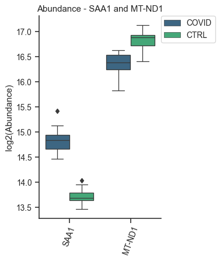

.. code-block:: python

   import sys
   sys.path.insert(1, 'C:/Users/Guilherme/omicscope/omicscope/src/')

OmicScope Object
================

Once data has been imported into OmicScope, users can access the input parameters and results generated by the package.

.. code-block:: python

   import omicscope as omics

   df = omics.OmicScope('../tests/data/proteins/progenesis.xls', Method = 'Progenesis', ControlGroup = 'CTRL')

.. code-block::

   OmicScope v 1.0.6 For help: Insert
   If you use  in published research, please cite: 'XXXXX'
   Reis-de-Oliveira G, Martins-de-Souza D. OmicScope: from quantitative proteomics to systems biology.

   User already performed statistical analysis
   OmicScope identifies: 721 deregulations

Conditions
----------

To access the conditions that were evaluated during proteomics experiments, users can use the following code:

.. code-block:: python

   df.Conditions

.. code-block::

   ['CTRL', 'COVID']

In this study, two groups were identified as WT and KO. Since we defined ControlGroup as 'WT' in the OmicScope function, we can check the value of the Control Group using the following command:

.. code-block:: python

   df.ControlGroup

   # If the user does not specify a control group, OmicScope 
   # will sort the groups alphabetically and store them in the same object.

.. code-block::

   'CTRL'

Differential Expression Analysis
--------------------------------

The data generated by differential expression analysis performed in OmicScope is stored in the **quant_data** object, which presents all information about proteins that were quantified, such as their p-value, p-Adjusted value, abundance in each sample, mean abundance in each group, and fold-change. 

.. code-block:: python

   df.quant_data.head()

.. raw:: html

   

   
   <table border="1" class="dataframe">
     <thead>
       <tr style="text-align: right;">
         <th></th>
         <th>Accession</th>
         <th>Peptide count</th>
         <th>Unique peptides</th>
         <th>Confidence score</th>
         <th>pvalue</th>
         <th>pAdjusted</th>
         <th>Max fold change</th>
         <th>Power</th>
         <th>Highest mean condition</th>
         <th>Lowest mean condition</th>
         <th>...</th>
         <th>VCC_HB_F_1.CTRL</th>
         <th>VCC_HB_F_1_2.CTRL</th>
         <th>VCC_HB_G_1.CTRL</th>
         <th>VCC_HB_G_1_2.CTRL</th>
         <th>TotalMean</th>
         <th>mean CTRL</th>
         <th>mean COVID</th>
         <th>fc</th>
         <th>log2(fc)</th>
         <th>-log10(pAdjusted)</th>
       </tr>
     </thead>
     <tbody>
       <tr>
         <th>0</th>
         <td>P0DJI8</td>
         <td>1</td>
         <td>1</td>
         <td>6.8809</td>
         <td>0.000000e+00</td>
         <td>0.000000</td>
         <td>2.192654</td>
         <td>1.000000</td>
         <td>COVID</td>
         <td>CTRL</td>
         <td>...</td>
         <td>12731.691404</td>
         <td>13233.853968</td>
         <td>15059.764993</td>
         <td>12423.510364</td>
         <td>2.387711e+04</td>
         <td>13618.731398</td>
         <td>2.986117e+04</td>
         <td>2.192654</td>
         <td>1.132678</td>
         <td>inf</td>
       </tr>
       <tr>
         <th>1</th>
         <td>P63313</td>
         <td>2</td>
         <td>0</td>
         <td>24.1939</td>
         <td>0.000000e+00</td>
         <td>0.000000</td>
         <td>3.823799</td>
         <td>1.000000</td>
         <td>COVID</td>
         <td>CTRL</td>
         <td>...</td>
         <td>17326.752285</td>
         <td>20652.845491</td>
         <td>14966.798526</td>
         <td>13492.881514</td>
         <td>4.194799e+04</td>
         <td>15070.491165</td>
         <td>5.762653e+04</td>
         <td>3.823799</td>
         <td>1.935007</td>
         <td>inf</td>
       </tr>
       <tr>
         <th>2</th>
         <td>P03886</td>
         <td>3</td>
         <td>0</td>
         <td>24.0213</td>
         <td>1.299387e-07</td>
         <td>0.000041</td>
         <td>1.386199</td>
         <td>0.999998</td>
         <td>CTRL</td>
         <td>COVID</td>
         <td>...</td>
         <td>122412.705135</td>
         <td>115490.657307</td>
         <td>136493.069796</td>
         <td>143254.473213</td>
         <td>9.672463e+04</td>
         <td>117378.518567</td>
         <td>8.467654e+04</td>
         <td>0.721397</td>
         <td>-0.471134</td>
         <td>4.390512</td>
       </tr>
       <tr>
         <th>3</th>
         <td>Q9BSM1</td>
         <td>2</td>
         <td>2</td>
         <td>12.2670</td>
         <td>5.516988e-07</td>
         <td>0.000105</td>
         <td>1.726615</td>
         <td>0.999984</td>
         <td>COVID</td>
         <td>CTRL</td>
         <td>...</td>
         <td>16792.299671</td>
         <td>17921.537559</td>
         <td>21259.563932</td>
         <td>23265.526938</td>
         <td>3.388698e+04</td>
         <td>23227.525099</td>
         <td>4.010499e+04</td>
         <td>1.726615</td>
         <td>0.787946</td>
         <td>3.979791</td>
       </tr>
       <tr>
         <th>4</th>
         <td>O94819</td>
         <td>32</td>
         <td>16</td>
         <td>190.5708</td>
         <td>5.575815e-07</td>
         <td>0.000105</td>
         <td>1.245223</td>
         <td>0.999984</td>
         <td>COVID</td>
         <td>CTRL</td>
         <td>...</td>
         <td>770950.278605</td>
         <td>798518.655465</td>
         <td>847853.002726</td>
         <td>836297.424534</td>
         <td>1.025731e+06</td>
         <td>888172.927691</td>
         <td>1.105973e+06</td>
         <td>1.245223</td>
         <td>0.316404</td>
         <td>3.979791</td>
       </tr>
     </tbody>
   </table>
   
5 rows × 56 columns

   

.. code-block:: python

   df.quant_data.columns

.. code-block::

   Index(['Accession', 'Peptide count', 'Unique peptides', 'Confidence score',
          'pvalue', 'pAdjusted', 'Max fold change', 'Power',
          'Highest mean condition', 'Lowest mean condition', 'Description',
          'gene_name', 'VCC_HB_1_1_2020.COVID', 'VCC_HB_1_2.COVID',
          'VCC_HB_2_1.COVID', 'VCC_HB_2_1_2.COVID', 'VCC_HB_3_1.COVID',
          'VCC_HB_3_1_2.COVID', 'VCC_HB_4_1.COVID', 'VCC_HB_4_1_2.COVID',
          'VCC_HB_5_1.COVID', 'VCC_HB_5_1_2.COVID', 'VCC_HB_6_1.COVID',
          'VCC_HB_6_1_2.COVID', 'VCC_HB_7_1.COVID', 'VCC_HB_7_1_2.COVID',
          'VCC_HB_8_1.COVID', 'VCC_HB_8_1_2.COVID', 'VCC_HB_9_1.COVID',
          'VCC_HB_9_1_2.COVID', 'VCC_HB_10_1.COVID', 'VCC_HB_10_1_2_.COVID',
          'VCC_HB_11_1.COVID', 'VCC_HB_11_1_2_.COVID', 'VCC_HB_12_1.COVID',
          'VCC_HB_12_1_2_.COVID', 'VCC_HB_A_1.CTRL', 'VCC_HB_A_1_2.CTRL',
          'VCC_HB_B_1.CTRL', 'VCC_HB_B_1_2.CTRL', 'VCC_HB_C_1.CTRL',
          'VCC_HB_C_1_2.CTRL', 'VCC_HB_D_1.CTRL', 'VCC_HB_D_1_2.CTRL',
          'VCC_HB_E_1.CTRL', 'VCC_HB_E_1_2.CTRL', 'VCC_HB_F_1.CTRL',
          'VCC_HB_F_1_2.CTRL', 'VCC_HB_G_1.CTRL', 'VCC_HB_G_1_2.CTRL',
          'TotalMean', 'mean CTRL', 'mean COVID', 'fc', 'log2(fc)',
          '-log10(pAdjusted)'],
         dtype='object', name=0)

A dataset containing only differentially expressed proteins and comparative results can be found in the **deps** object.

.. code-block:: python

   df.deps

.. raw:: html

   

   
   <table border="1" class="dataframe">
     <thead>
       <tr style="text-align: right;">
         <th></th>
         <th>gene_name</th>
         <th>Accession</th>
         <th>pAdjusted</th>
         <th>-log10(pAdjusted)</th>
         <th>log2(fc)</th>
       </tr>
     </thead>
     <tbody>
       <tr>
         <th>0</th>
         <td>SAA1</td>
         <td>P0DJI8</td>
         <td>0.000000</td>
         <td>inf</td>
         <td>1.132678</td>
       </tr>
       <tr>
         <th>1</th>
         <td>TMSB10</td>
         <td>P63313</td>
         <td>0.000000</td>
         <td>inf</td>
         <td>1.935007</td>
       </tr>
       <tr>
         <th>2</th>
         <td>MT-ND1</td>
         <td>P03886</td>
         <td>0.000041</td>
         <td>4.390512</td>
         <td>-0.471134</td>
       </tr>
       <tr>
         <th>3</th>
         <td>PCGF1</td>
         <td>Q9BSM1</td>
         <td>0.000105</td>
         <td>3.979791</td>
         <td>0.787946</td>
       </tr>
       <tr>
         <th>4</th>
         <td>KBTBD11</td>
         <td>O94819</td>
         <td>0.000105</td>
         <td>3.979791</td>
         <td>0.316404</td>
       </tr>
       <tr>
         <th>...</th>
         <td>...</td>
         <td>...</td>
         <td>...</td>
         <td>...</td>
         <td>...</td>
       </tr>
       <tr>
         <th>730</th>
         <td>NDUFAF4</td>
         <td>Q9P032</td>
         <td>0.049305</td>
         <td>1.307110</td>
         <td>-0.309369</td>
       </tr>
       <tr>
         <th>731</th>
         <td>HPCAL1</td>
         <td>P37235</td>
         <td>0.049335</td>
         <td>1.306847</td>
         <td>0.273795</td>
       </tr>
       <tr>
         <th>732</th>
         <td>METTL7A</td>
         <td>Q9H8H3</td>
         <td>0.049393</td>
         <td>1.306333</td>
         <td>0.432424</td>
       </tr>
       <tr>
         <th>733</th>
         <td>NDEL1</td>
         <td>Q9GZM8</td>
         <td>0.049710</td>
         <td>1.303558</td>
         <td>0.191609</td>
       </tr>
       <tr>
         <th>734</th>
         <td>TKFC</td>
         <td>Q3LXA3</td>
         <td>0.049777</td>
         <td>1.302972</td>
         <td>0.248767</td>
       </tr>
     </tbody>
   </table>
   
721 rows × 5 columns

   

Plots and Figures
-----------------

Plots and figures are crucial components of the OmicScope workflow, allowing users to generate ready-to-publish figures and gain insights into proteomics datasets.

All functions below can be saved as a vector (.svg extension - vector=True) or static (.png extension - vector=False) by using the ``save`` parameter. By default, the resolution is set to 300 dpi (dpi=300).

Moreover, several functions enable users to highlight or select proteins of interest to be plotted. To do so, simply specify the protein's gene name at the beginning of the function call. Finally, OmicScope provides color palette options based on the suggestions of the `Matplotlib package <https://matplotlib.org/stable/tutorials/colors/colormaps.html>`_.

General Figures
^^^^^^^^^^^^^^^

Identification Barplot - ``object.bar_ident()``
~~~~~~~~~~~~~~~~~~~~~~~~~~~~~~~~~~~~~~~~~~~~~~~~~~~

The ``bar_ident()`` function generates a bar plot that displays the number of proteins quantified and the number of differentially regulated proteins in the experiment. By default, the function performs a log-transformation of the y-axis to improve the visualization of the differentially regulated bars, as the number of differentially regulated proteins is typically smaller than the total number of proteins evaluated in the study.

.. code-block:: python

   df.bar_ident(logscale=True, dpi = 90)

.. image:: omicscope_files/omicscope_15_0.png
   :target: omicscope_files/omicscope_15_0.png
   :alt: png

Dynamic range plot - ``object.DynamicRange()``
~~~~~~~~~~~~~~~~~~~~~~~~~~~~~~~~~~~~~~~~~~~~~~~~~~

The Dynamic Range plot is a classical plot in proteomics studies. It ranks proteins according to their abundance and highlights the proteome coverage in the study. Depending on the quantitative proteomics methods applied, the Dynamic Range plot may also suggest a ratio between proteins quantified in the study. In the function below, it is possible to annotate proteins of interest in the plot by adding their ``gene_name`` as ``args``.

.. code-block:: python

   df.DynamicRange('SAA1', 'TMSB10',dpi = 90)

.. image:: omicscope_files/omicscope_17_0.png
   :target: omicscope_files/omicscope_17_0.png
   :alt: png

Volcano Plot - *object.volcano()*
~~~~~~~~~~~~~~~~~~~~~~~~~~~~~~~~~~~~~

The volcano plot visualizes the distribution of proteins according to their p-values and fold-changes. In addition to highlighting differentially regulated proteins as individual entities, it serves as a proxy for quality control of normalization methods, since the data presents a normal distribution on the x-axis and a positively skewed distribution on the y-axis.

.. code-block:: python

   df.volcano('SAA1', 'TMSB10',dpi = 96)

.. image:: omicscope_files/omicscope_19_0.png
   :target: omicscope_files/omicscope_19_0.png
   :alt: png

MA plot - *object.MAplot()*
~~~~~~~~~~~~~~~~~~~~~~~~~~~~~~~

The MA-plot is a commonly used tool in proteomics data analysis that allows evaluation of data normalization. It compares the abundance levels of individual proteins with their fold-changes. A general expectation is that only a few proteins exhibit a change in expression, and thus, high deviations from zero on the y-axis may indicate that the data requires further normalization.

.. code-block:: python

   df.MAplot('SAA1', 'TMSB10', dpi=96)

.. image:: omicscope_files/omicscope_21_0.png
   :target: omicscope_files/omicscope_21_0.png
   :alt: png

Evaluate abundance of subset of proteins:
^^^^^^^^^^^^^^^^^^^^^^^^^^^^^^^^^^^^^^^^^

OmicScope provides two options for visualizing individual proteins: barplot and boxplot. Essentially, both functions work in the same way; users call the function by specifying the target proteins, and a unique figure for all proteins (with their respective conditions) is generated. By default, protein abundance is log-transformed.

Bar plot of proteins - *object.bar_protein(args)*
~~~~~~~~~~~~~~~~~~~~~~~~~~~~~~~~~~~~~~~~~~~~~~~~~~~~~

.. code-block:: python

   df.bar_protein('SAA1', 'TMSB10', logscale=True, palette='viridis', dpi=90)

.. image:: omicscope_files/omicscope_23_0.png
   :target: omicscope_files/omicscope_23_0.png
   :alt: png

Boxplot plot of proteins - *object.bar_protein(args)*
~~~~~~~~~~~~~~~~~~~~~~~~~~~~~~~~~~~~~~~~~~~~~~~~~~~~~~~~~

.. code-block:: python

   df.boxplot_protein('SAA1', 'TMSB10', palette = 'viridis', dpi=90)

.. image:: omicscope_files/omicscope_25_0.png
   :target: omicscope_files/omicscope_25_0.png
   :alt: png

Clustering Analysis
^^^^^^^^^^^^^^^^^^^

OmicScope also performs clustering analysis using three algorithms: hierarchical clustering, principal component analysis (PCA), and k-means. 

Heatmap - *object.heatmap()*
~~~~~~~~~~~~~~~~~~~~~~~~~~~~~~~~

The Heatmap function in OmicScope performs hierarchical clustering for both samples and proteins. Users have the option to ignore the sample clustering by setting c_cluster=False. Additionally, users can select specific proteins to plot on the heatmap.

.. code-block:: python

   df.heatmap(dpi=90, line=0)

Pearson's Correlation - *object.correlation()*
~~~~~~~~~~~~~~~~~~~~~~~~~~~~~~~~~~~~~~~~~~~~~~~~~~

The correlation function calculates the pair-wise Pearson's correlation between samples, and then performs hierarchical clustering for that correlation matrix. This plot is useful in identifying outliers, technical variations, normalization issues, and the impact of differentially regulated proteins on the entire proteome. By default, the p-value threshold is set to 1.0 when evaluating the entire proteome.

.. code-block:: python

   df.correlation(dpi=90, line=0)

.. image:: omicscope_files/omicscope_30_0.png
   :target: omicscope_files/omicscope_30_0.png
   :alt: png

Principal Component Analysis - *object.pca()*
~~~~~~~~~~~~~~~~~~~~~~~~~~~~~~~~~~~~~~~~~~~~~~~~~

Principal Component Analysis (PCA) is a method available in OmicScope for performing sample clustering. By default, OmicScope includes all quantified proteins (pvalue=1.0) for the analysis, but users can choose lower p-values for other purposes.

.. code-block:: python

   df.pca(pvalue = 0.05, dpi = 90)

.. image:: omicscope_files/omicscope_32_0.png
   :target: omicscope_files/omicscope_32_0.png
   :alt: png

K-Means - *object.bigtrend()*
~~~~~~~~~~~~~~~~~~~~~~~~~~~~~~~~~

The bigtrend function is primarily designed for longitudinal analysis, such as TimeCourse experiments, and it groups samples based on protein abundance using the k-means algorithm to identify co-expressed proteins. By default, OmicScope suggests a k-number of clusters that can explain the data, but users can choose the number of clusters, such as k_cluster=2 for up- and down-regulations, that better explain the data. After generating the plot, the function returns a table (DataFrame) containing the respective cluster, or trend, for each protein.

.. code-block:: python

   df.bigtrend(dpi=96)

.. code-block::

   KneeLocator identifies: 4 clusters

.. image:: omicscope_files/omicscope_34_1.png
   :target: omicscope_files/omicscope_34_1.png
   :alt: png

.. raw:: html

   

   
   <table border="1" class="dataframe">
     <thead>
       <tr style="text-align: right;">
         <th></th>
         <th>Accession</th>
         <th>cluster</th>
         <th>sample</th>
         <th>value</th>
         <th>Condition</th>
         <th>gene_name</th>
       </tr>
     </thead>
     <tbody>
       <tr>
         <th>0</th>
         <td>P0DJI8</td>
         <td>1</td>
         <td>COVID-1</td>
         <td>0.708253</td>
         <td>COVID</td>
         <td>SAA1</td>
       </tr>
       <tr>
         <th>1</th>
         <td>P63313</td>
         <td>1</td>
         <td>COVID-1</td>
         <td>1.073007</td>
         <td>COVID</td>
         <td>TMSB10</td>
       </tr>
       <tr>
         <th>2</th>
         <td>P03886</td>
         <td>0</td>
         <td>COVID-1</td>
         <td>0.296643</td>
         <td>COVID</td>
         <td>MT-ND1</td>
       </tr>
       <tr>
         <th>3</th>
         <td>Q9BSM1</td>
         <td>2</td>
         <td>COVID-1</td>
         <td>-0.565035</td>
         <td>COVID</td>
         <td>PCGF1</td>
       </tr>
       <tr>
         <th>4</th>
         <td>O94819</td>
         <td>2</td>
         <td>COVID-1</td>
         <td>0.030960</td>
         <td>COVID</td>
         <td>KBTBD11</td>
       </tr>
       <tr>
         <th>...</th>
         <td>...</td>
         <td>...</td>
         <td>...</td>
         <td>...</td>
         <td>...</td>
         <td>...</td>
       </tr>
       <tr>
         <th>27393</th>
         <td>Q9P032</td>
         <td>0</td>
         <td>CTRL-14</td>
         <td>1.395631</td>
         <td>CTRL</td>
         <td>NDUFAF4</td>
       </tr>
       <tr>
         <th>27394</th>
         <td>P37235</td>
         <td>3</td>
         <td>CTRL-14</td>
         <td>-0.317758</td>
         <td>CTRL</td>
         <td>HPCAL1</td>
       </tr>
       <tr>
         <th>27395</th>
         <td>Q9H8H3</td>
         <td>2</td>
         <td>CTRL-14</td>
         <td>-0.827069</td>
         <td>CTRL</td>
         <td>METTL7A</td>
       </tr>
       <tr>
         <th>27396</th>
         <td>Q9GZM8</td>
         <td>1</td>
         <td>CTRL-14</td>
         <td>-0.758909</td>
         <td>CTRL</td>
         <td>NDEL1</td>
       </tr>
       <tr>
         <th>27397</th>
         <td>Q3LXA3</td>
         <td>2</td>
         <td>CTRL-14</td>
         <td>-1.128265</td>
         <td>CTRL</td>
         <td>TKFC</td>
       </tr>
     </tbody>
   </table>
   
27398 rows × 6 columns

   

Protein-Protein Interactions - *object.PPInteractions()*
^^^^^^^^^^^^^^^^^^^^^^^^^^^^^^^^^^^^^^^^^^^^^^^^^^^^^^^^^^^^

Proteomics data analysis solely based on protein abundance can be quite challenging when trying to derive biological insights. To overcome this limitation, OmicScope utilizes the STRING API to retrieve protein-protein interactions, including functional or physical interactions.

PPInteractions function allows users to set the evidence score to consider protein-protein interactions (default to 0.6), search for communities based on the Louvain algorithm, and choose between physical or functional interactions (default to 'functional'). The user also needs to correctly set the NCBI identifier for the studied organism (default to '9606' for Human, Mus musculus = 10090, Rattus norvegicus = 10116).

Since plotting graphs can be challenging depending on the amount of data, OmicScope provides users with the ability to export network data to software like Cytoscape and Gephi for better visualization. To export the plot to other tools, users only need to specify save=PATH_TO_SAVE.

.. code-block:: python

   df.PPInteractions(dpi=96,)

.. code-block::

   <networkx.classes.graph.Graph at 0x22a28c89650>

.. image:: omicscope_files/omicscope_36_1.png
   :target: omicscope_files/omicscope_36_1.png
   :alt: png

