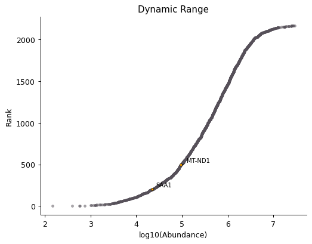

OmicScope Object
================

This section provides an overview of the diverse functionalities of OmicScope, which streamline and enhance proteomics analysis. After importing data into OmicScope, users can access the input parameters and results.

.. code-block:: python

   import omicscope as omics

   df = omics.OmicScope('../../tests/data/proteins/progenesis.xls', Method = 'Progenesis', ControlGroup = 'CTRL')

.. code-block::

   OmicScope v 1.3.12 For help: Insert
   If you use  in published research, please cite: 'XXXXX'
   Reis-de-Oliveira G, Martins-de-Souza D. OmicScope: from quantitative proteomics to systems biology.

   User already performed statistical analysis
   OmicScope identifies: 697 deregulations

Conditions
----------

Users can access conditions evaluated during proteomics experiments by using the following code:

.. code-block:: python

   df.Conditions

.. code-block::

   ['CTRL', 'COVID']

In this example, two groups ("WT" and "KO") are identified as conditions. Since the example above defined ``ControlGroup`` as 'WT', it is possible to check the value of the Control Group using the following command:

.. code-block:: python

   df.ControlGroup

   # If the user does not specify a control group, OmicScope 
   # will sort the groups alphabetically and store them in the same object.

.. code-block::

   'CTRL'

Differential Expression Analysis
--------------------------------

Differential expression analysis in OmicScope generates results stored in the ``quant_data`` object. This data includes information on proteins quantified, such as p-values, p-Adjusted values, abundance in each sample, mean abundance in each group, and fold-change. 

.. code-block:: python

   df.quant_data.head()

.. raw:: html

   

   
   <table border="1" class="dataframe">
     <thead>
       <tr style="text-align: right;">
         <th></th>
         <th>Accession</th>
         <th>Peptide count</th>
         <th>Unique peptides</th>
         <th>Confidence score</th>
         <th>pvalue</th>
         <th>pAdjusted</th>
         <th>Max fold change</th>
         <th>Power</th>
         <th>Highest mean condition</th>
         <th>Lowest mean condition</th>
         <th>...</th>
         <th>VCC_HB_F_1.CTRL</th>
         <th>VCC_HB_F_1_2.CTRL</th>
         <th>VCC_HB_G_1.CTRL</th>
         <th>VCC_HB_G_1_2.CTRL</th>
         <th>TotalMean</th>
         <th>mean CTRL</th>
         <th>mean COVID</th>
         <th>fc</th>
         <th>log2(fc)</th>
         <th>-log10(pAdjusted)</th>
       </tr>
     </thead>
     <tbody>
       <tr>
         <th>0</th>
         <td>P0DJI8</td>
         <td>1</td>
         <td>1</td>
         <td>6.8809</td>
         <td>0.000000e+00</td>
         <td>0.000000</td>
         <td>2.192654</td>
         <td>1.000000</td>
         <td>COVID</td>
         <td>CTRL</td>
         <td>...</td>
         <td>12731.691404</td>
         <td>13233.853968</td>
         <td>15059.764993</td>
         <td>12423.510364</td>
         <td>2.387711e+04</td>
         <td>13618.731398</td>
         <td>2.986117e+04</td>
         <td>2.192654</td>
         <td>1.132678</td>
         <td>inf</td>
       </tr>
       <tr>
         <th>2</th>
         <td>P03886</td>
         <td>3</td>
         <td>0</td>
         <td>24.0213</td>
         <td>1.299387e-07</td>
         <td>0.000041</td>
         <td>1.386199</td>
         <td>0.999998</td>
         <td>CTRL</td>
         <td>COVID</td>
         <td>...</td>
         <td>122412.705135</td>
         <td>115490.657307</td>
         <td>136493.069796</td>
         <td>143254.473213</td>
         <td>9.672463e+04</td>
         <td>117378.518567</td>
         <td>8.467654e+04</td>
         <td>0.721397</td>
         <td>-0.471134</td>
         <td>4.390512</td>
       </tr>
       <tr>
         <th>3</th>
         <td>Q9BSM1</td>
         <td>2</td>
         <td>2</td>
         <td>12.2670</td>
         <td>5.516988e-07</td>
         <td>0.000105</td>
         <td>1.726615</td>
         <td>0.999984</td>
         <td>COVID</td>
         <td>CTRL</td>
         <td>...</td>
         <td>16792.299671</td>
         <td>17921.537559</td>
         <td>21259.563932</td>
         <td>23265.526938</td>
         <td>3.388698e+04</td>
         <td>23227.525099</td>
         <td>4.010499e+04</td>
         <td>1.726615</td>
         <td>0.787946</td>
         <td>3.979791</td>
       </tr>
       <tr>
         <th>4</th>
         <td>O94819</td>
         <td>32</td>
         <td>16</td>
         <td>190.5708</td>
         <td>5.575815e-07</td>
         <td>0.000105</td>
         <td>1.245223</td>
         <td>0.999984</td>
         <td>COVID</td>
         <td>CTRL</td>
         <td>...</td>
         <td>770950.278605</td>
         <td>798518.655465</td>
         <td>847853.002726</td>
         <td>836297.424534</td>
         <td>1.025731e+06</td>
         <td>888172.927691</td>
         <td>1.105973e+06</td>
         <td>1.245223</td>
         <td>0.316404</td>
         <td>3.979791</td>
       </tr>
       <tr>
         <th>5</th>
         <td>Q14894</td>
         <td>17</td>
         <td>8</td>
         <td>146.9671</td>
         <td>7.825126e-07</td>
         <td>0.000111</td>
         <td>1.451950</td>
         <td>0.999974</td>
         <td>COVID</td>
         <td>CTRL</td>
         <td>...</td>
         <td>477789.148751</td>
         <td>479162.075245</td>
         <td>557800.495276</td>
         <td>576637.794756</td>
         <td>6.018212e+05</td>
         <td>468182.298998</td>
         <td>6.797772e+05</td>
         <td>1.451950</td>
         <td>0.537992</td>
         <td>3.953746</td>
       </tr>
     </tbody>
   </table>
   
5 rows × 56 columns

   

.. code-block:: python

   df.quant_data.columns

.. code-block::

   Index(['Accession', 'Peptide count', 'Unique peptides', 'Confidence score',
          'pvalue', 'pAdjusted', 'Max fold change', 'Power',
          'Highest mean condition', 'Lowest mean condition', 'Description',
          'gene_name', 'VCC_HB_1_1_2020.COVID', 'VCC_HB_1_2.COVID',
          'VCC_HB_2_1.COVID', 'VCC_HB_2_1_2.COVID', 'VCC_HB_3_1.COVID',
          'VCC_HB_3_1_2.COVID', 'VCC_HB_4_1.COVID', 'VCC_HB_4_1_2.COVID',
          'VCC_HB_5_1.COVID', 'VCC_HB_5_1_2.COVID', 'VCC_HB_6_1.COVID',
          'VCC_HB_6_1_2.COVID', 'VCC_HB_7_1.COVID', 'VCC_HB_7_1_2.COVID',
          'VCC_HB_8_1.COVID', 'VCC_HB_8_1_2.COVID', 'VCC_HB_9_1.COVID',
          'VCC_HB_9_1_2.COVID', 'VCC_HB_10_1.COVID', 'VCC_HB_10_1_2_.COVID',
          'VCC_HB_11_1.COVID', 'VCC_HB_11_1_2_.COVID', 'VCC_HB_12_1.COVID',
          'VCC_HB_12_1_2_.COVID', 'VCC_HB_A_1.CTRL', 'VCC_HB_A_1_2.CTRL',
          'VCC_HB_B_1.CTRL', 'VCC_HB_B_1_2.CTRL', 'VCC_HB_C_1.CTRL',
          'VCC_HB_C_1_2.CTRL', 'VCC_HB_D_1.CTRL', 'VCC_HB_D_1_2.CTRL',
          'VCC_HB_E_1.CTRL', 'VCC_HB_E_1_2.CTRL', 'VCC_HB_F_1.CTRL',
          'VCC_HB_F_1_2.CTRL', 'VCC_HB_G_1.CTRL', 'VCC_HB_G_1_2.CTRL',
          'TotalMean', 'mean CTRL', 'mean COVID', 'fc', 'log2(fc)',
          '-log10(pAdjusted)'],
         dtype='object', name=0)

A dataset containing differentially expressed proteins and comparative results can be found in the ``deps`` object.

.. code-block:: python

   df.deps

.. raw:: html

   

   
   <table border="1" class="dataframe">
     <thead>
       <tr style="text-align: right;">
         <th></th>
         <th>gene_name</th>
         <th>Accession</th>
         <th>pAdjusted</th>
         <th>-log10(pAdjusted)</th>
         <th>log2(fc)</th>
       </tr>
     </thead>
     <tbody>
       <tr>
         <th>0</th>
         <td>SAA1</td>
         <td>P0DJI8</td>
         <td>0.000000</td>
         <td>inf</td>
         <td>1.132678</td>
       </tr>
       <tr>
         <th>2</th>
         <td>MT-ND1</td>
         <td>P03886</td>
         <td>0.000041</td>
         <td>4.390512</td>
         <td>-0.471134</td>
       </tr>
       <tr>
         <th>3</th>
         <td>PCGF1</td>
         <td>Q9BSM1</td>
         <td>0.000105</td>
         <td>3.979791</td>
         <td>0.787946</td>
       </tr>
       <tr>
         <th>4</th>
         <td>KBTBD11</td>
         <td>O94819</td>
         <td>0.000105</td>
         <td>3.979791</td>
         <td>0.316404</td>
       </tr>
       <tr>
         <th>5</th>
         <td>CRYM</td>
         <td>Q14894</td>
         <td>0.000111</td>
         <td>3.953746</td>
         <td>0.537992</td>
       </tr>
       <tr>
         <th>...</th>
         <td>...</td>
         <td>...</td>
         <td>...</td>
         <td>...</td>
         <td>...</td>
       </tr>
       <tr>
         <th>730</th>
         <td>NDUFAF4</td>
         <td>Q9P032</td>
         <td>0.049305</td>
         <td>1.307110</td>
         <td>-0.309369</td>
       </tr>
       <tr>
         <th>731</th>
         <td>HPCAL1</td>
         <td>P37235</td>
         <td>0.049335</td>
         <td>1.306847</td>
         <td>0.273795</td>
       </tr>
       <tr>
         <th>732</th>
         <td>METTL7A</td>
         <td>Q9H8H3</td>
         <td>0.049393</td>
         <td>1.306333</td>
         <td>0.432424</td>
       </tr>
       <tr>
         <th>733</th>
         <td>NDEL1</td>
         <td>Q9GZM8</td>
         <td>0.049710</td>
         <td>1.303558</td>
         <td>0.191609</td>
       </tr>
       <tr>
         <th>734</th>
         <td>TKFC</td>
         <td>Q3LXA3</td>
         <td>0.049777</td>
         <td>1.302972</td>
         <td>0.248767</td>
       </tr>
     </tbody>
   </table>
   
697 rows × 5 columns

   

Plots and Figures
-----------------

Plots and figures are essential components of the OmicScope workflow, facilitating data visualization and insights into proteomics datasets. These functions allow the user to customize and save (\ ``save = "PATH_OF_FOLDER_TO_SAVE"``\ ) plots as vector (.svg extension - ``vector=True``\ ) or static images (.png extension - ``vector=False``\ ). By default, the resolution is set to 300 dpi (\ ``dpi=300``\ ).

Moreover, several functions enable users to highlight or select proteins of interest to be plotted. To do so, simply specify the protein's gene name at the beginning of the function call. Finally, OmicScope provides color palette options based on the suggestions of the `Matplotlib package <https://matplotlib.org/stable/tutorials/colors/colormaps.html>`_.

General Figures
^^^^^^^^^^^^^^^

Identification Barplot - ``object.bar_ident()``
~~~~~~~~~~~~~~~~~~~~~~~~~~~~~~~~~~~~~~~~~~~~~~~~~~~

The bar_ident() function generates a bar plot displaying the number of quantified proteins and differentially regulated proteins in the experiment. It can perform a log-transformation of the y-axis for better visualization.

.. code-block:: python

   df.bar_ident(logscale=True, dpi = 90)

.. image:: 3_omicscope_files/3_omicscope_15_0.png
   :target: 3_omicscope_files/3_omicscope_15_0.png
   :alt: png

.. code-block::

   <AxesSubplot: title={'left': 'CTRL vs COVID'}, ylabel='#Proteins'>

Dynamic range plot - ``object.DynamicRange()``
~~~~~~~~~~~~~~~~~~~~~~~~~~~~~~~~~~~~~~~~~~~~~~~~~~

The Dynamic Range plot is a classical plot in proteomics studies. It ranks proteins by abundance and highlights the proteome coverage. Depending on the quantitative proteomics methods applied, the Dynamic Range plot may also suggest a ratio between proteins quantified in the study. In the function below, it is possible to annotate proteins of interest in the plot by adding their ``gene_name`` as ``args``.

.. code-block:: python

   df.DynamicRange('SAA1', 'MT-ND1',dpi = 90)

.. image:: 3_omicscope_files/3_omicscope_17_0.png
   :target: 3_omicscope_files/3_omicscope_17_0.png
   :alt: png

Volcano Plot - ``object.volcano()``
~~~~~~~~~~~~~~~~~~~~~~~~~~~~~~~~~~~~~~~

The volcano plot visualizes proteins based on p-values and fold-changes. In addition to highlighting differentially regulated proteins as individual entities, it serves as a proxy for quality control of normalization methods, since the data presents a normal distribution on the x-axis and a positively skewed distribution on the y-axis.

.. code-block:: python

   df.volcano('SAA1', 'MT-ND1',dpi = 96)

MA plot - ``object.MAplot()``
~~~~~~~~~~~~~~~~~~~~~~~~~~~~~~~~~

The MA-plot compares protein abundance levels with their fold-changes, helping evaluate data normalization. A general expectation is that only a few proteins exhibit a change in expression, and thus, high deviations from zero on the y-axis may indicate that the data requires further normalization.

.. code-block:: python

   df.MAplot('SAA1', 'MT-ND1', dpi=96)

Evaluate abundance of subset of proteins:
^^^^^^^^^^^^^^^^^^^^^^^^^^^^^^^^^^^^^^^^^

OmicScope offers two options for visualizing individual proteins: barplots and boxplots. Both functions work similarly, allowing users to specify target proteins. The result is a unique figure encompassing all proteins and their respective conditions, with the option for log-transformation of protein abundance.

Bar plot of proteins - ``object.bar_protein(args)``
~~~~~~~~~~~~~~~~~~~~~~~~~~~~~~~~~~~~~~~~~~~~~~~~~~~~~~~

.. code-block:: python

   df.bar_protein('SAA1', 'MT-ND1', logscale=True, palette='viridis', dpi=90)

Boxplot plot of proteins - ``object.bar_protein(args)``
~~~~~~~~~~~~~~~~~~~~~~~~~~~~~~~~~~~~~~~~~~~~~~~~~~~~~~~~~~~

.. code-block:: python

   df.boxplot_protein('SAA1', 'MT-ND1', palette='viridis', dpi=90)

.. image:: 3_omicscope_files/3_omicscope_25_0.png
   :target: 3_omicscope_files/3_omicscope_25_0.png
   :alt: png

Clustering Analysis
^^^^^^^^^^^^^^^^^^^

OmicScope offers clustering analysis using hierarchical clustering, principal component analysis (PCA), and k-means.

Heatmap - ``object.heatmap()``
~~~~~~~~~~~~~~~~~~~~~~~~~~~~~~~~~~

The Heatmap function performs hierarchical clustering for samples and proteins. Users can customize sample clustering and select specific proteins to display.

.. code-block:: python

   df.heatmap(dpi=90, line=0)

.. image:: 3_omicscope_files/3_omicscope_28_0.png
   :target: 3_omicscope_files/3_omicscope_28_0.png
   :alt: png

Sample Correlation - ``object.correlation()``
~~~~~~~~~~~~~~~~~~~~~~~~~~~~~~~~~~~~~~~~~~~~~~~~~

This function calculates pair-wise correlation between samples and performs hierarchical clustering for the correlation matrix. By default, OmicScope uses Pearson's correlation to perform similarity index. 

This plot is useful in identifying outliers, technical variations, normalization issues, and the impact of differentially regulated proteins on the entire proteome. By default, the p-value threshold is set to 1.0 when evaluating the entire proteome.

.. code-block:: python

   df.correlation(dpi=90, line=0)

.. image:: 3_omicscope_files/3_omicscope_30_0.png
   :target: 3_omicscope_files/3_omicscope_30_0.png
   :alt: png

Principal Component Analysis - ``object.pca()``
~~~~~~~~~~~~~~~~~~~~~~~~~~~~~~~~~~~~~~~~~~~~~~~~~~~

Principal Component Analysis (PCA) is available for sample clustering, with options to adjust the p-value threshold for protein inclusion. 

.. code-block:: python

   df.pca(pvalue = 0.05, dpi = 90)

.. image:: 3_omicscope_files/3_omicscope_32_0.png
   :target: 3_omicscope_files/3_omicscope_32_0.png
   :alt: png

K-Means - ``object.k_trend()``
~~~~~~~~~~~~~~~~~~~~~~~~~~~~~~~~~~

The bigtrend function is primarily designed for longitudinal analysis, such as TimeCourse experiments, and it groups samples based on protein abundance using the k-means algorithm to identify co-expressed proteins. 

By default, OmicScope suggests a k-number of clusters that can explain the data, but users can manualy set the number of clusters (e.g ``k_cluster=2`` for up- and down-regulations).

.. code-block:: python

   df.k_trend(dpi=96)

.. code-block::

   KneeLocator identifies: 4 clusters

.. image:: 3_omicscope_files/3_omicscope_34_1.png
   :target: 3_omicscope_files/3_omicscope_34_1.png
   :alt: png

.. raw:: html

   

   
   <table border="1" class="dataframe">
     <thead>
       <tr style="text-align: right;">
         <th></th>
         <th>cluster</th>
         <th>gene_name</th>
       </tr>
     </thead>
     <tbody>
       <tr>
         <th>0</th>
         <td>0</td>
         <td>[PCGF1, KBTBD11, WDR1, PI4KA, STX7, SNX1, LMNA...</td>
       </tr>
       <tr>
         <th>1</th>
         <td>1</td>
         <td>[MT-ND1, ASS1, PMM1, OXCT1, POLE, STX8, NDUFB3...</td>
       </tr>
       <tr>
         <th>2</th>
         <td>2</td>
         <td>[SAA1, CRYM, MAPT, PTMS, ARPC5L, ERH, NUDT21, ...</td>
       </tr>
       <tr>
         <th>3</th>
         <td>3</td>
         <td>[CAMK2D, MAP6, CCT8, SLC9A3R1, RPL11, MBP, HSP...</td>
       </tr>
     </tbody>
   </table>
   

Protein-Protein Interactions - ``object.PPInteractions()``
^^^^^^^^^^^^^^^^^^^^^^^^^^^^^^^^^^^^^^^^^^^^^^^^^^^^^^^^^^^^^^

Proteomics data analysis solely based on protein abundance can be quite challenging when trying to derive biological insights. To overcome this limitation, OmicScope utilizes the STRING API to retrieve protein-protein interactions, including functional or physical interactions.

The PPInteractions function in OmicScope allows users to customize the evidence score for considering protein-protein interactions (default set to ``0.6``\ ). It also supports searching for communities based on the Louvain algorithm and choosing between physical or functional interactions (default set to ``'functional'``\ ). Users need to specify the correct NCBI identifier for the organism under study (default set to ``9606`` for Human; other options include Mus musculus = 10090, and Rattus norvegicus = 10116).

Since the complexity of plotting graphs can vary depending on the data, OmicScope provides the option to export network data to visualization software like Cytoscape and Gephi for more comprehensive and customized visualization. To export a plot to other tools, users only need to specify the save parameter as PATH_TO_SAVE.

.. code-block:: python

   df.PPInteractions(pvalue=0.01, dpi=96)

.. code-block::

   <networkx.classes.graph.Graph at 0x1429b28d050>

.. image:: 3_omicscope_files/3_omicscope_36_1.png
   :target: 3_omicscope_files/3_omicscope_36_1.png
   :alt: png

