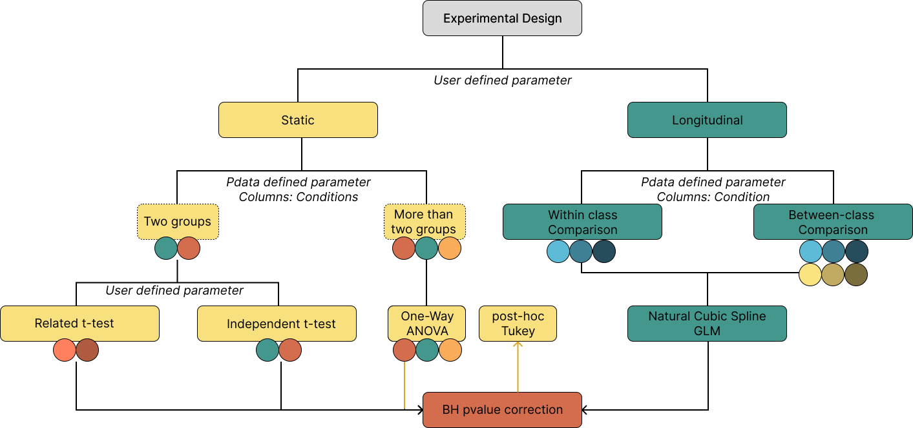

Statistical Analysis
====================

OmicScope provides a comprehensive toolbox for performing differential proteomics, which includes statistical analysis for both static and longitudinal experimental designs (see Figure below). By default, OmicScope assumes a static workflow (ExperimentalDesign='static'), which performs t-tests or analysis of variance (ANOVA). For longitudinal analysis (ExperimentalDesign='longitudinal'), OmicScope fits a spline curve to the timecourse, as suggested by Storey (2005), evaluating both within-group and between-group differences. Once OmicScope has calculated the nominal p-values, it applies the Benjamini-Hochberg correction for multiple hypothesis testing and reports the adjusted p-value (pAdjusted). Additionally, users can import statistical analysis from alternative software by adding a "pvalue" or "pAdjusted" column into rdata on the General input method.

When importing data into OmicScope, users must select the correct method to perform data handling. For Progenesis and PatternLab methods, OmicScope can identify and select the groups according to the respective software output, always considering a static experimental design. However, for General and MaxQuant methods, OmicScope requires phenotype data (pdata) containing as much information as possible regarding the samples and groups. Finally, in all cases, OmicScope allows users to add external pdata to the workflow, which can guide the statistical workflow that best fits the experimental design performed (see below).

It should be noted that pdata is required to perform longitudinal analysis.

Static Experimental Design
--------------------------

Most proteomics experiments aim to compare the proteomic signatures between independent groups, which is why OmicScope defaults to a static experimental design (ExperimentalDesign='static'). The static workflow involves two statistical tests: t-test and ANOVA.

When comparing two groups, OmicScope performs an independent t-test (independent_ttest=True) if the groups are independent, and a related t-test (independent_ttest=False) if the groups are related.

When comparing more than two groups, OmicScope performs a one-way ANOVA. After applying the Benjamini-Hochberg correction for multiple hypothesis testing, OmicScope also performs a Tukey post-hoc correction on proteins with a pAdjusted value less than 0.05, highlighting the groups that have significant differences.

When generating a pdata file to run the static workflow, the user should include the following columns:

'Sample': an identifier for each sample analyzed (must match the column names in the assay)
'Condition': the respective group for each sample.
'Biological': the respective biological replicates for each sample.

.. code-block:: python

   # Pdata for static experimental designs
   import pandas as pd
   pdata = pd.read_excel('../tests/data/proteins/general.xlsx', sheet_name=2)
   pdata

.. raw:: html

   

   
   <table border="1" class="dataframe">
     <thead>
       <tr style="text-align: right;">
         <th></th>
         <th>Sample</th>
         <th>Condition</th>
         <th>Biological</th>
       </tr>
     </thead>
     <tbody>
       <tr>
         <th>0</th>
         <td>VCC_HB_1_1_2020</td>
         <td>COVID</td>
         <td>1</td>
       </tr>
       <tr>
         <th>1</th>
         <td>VCC_HB_1_2</td>
         <td>COVID</td>
         <td>1</td>
       </tr>
       <tr>
         <th>2</th>
         <td>VCC_HB_2_1</td>
         <td>COVID</td>
         <td>2</td>
       </tr>
       <tr>
         <th>3</th>
         <td>VCC_HB_2_1_2</td>
         <td>COVID</td>
         <td>2</td>
       </tr>
       <tr>
         <th>4</th>
         <td>VCC_HB_3_1</td>
         <td>COVID</td>
         <td>3</td>
       </tr>
       <tr>
         <th>5</th>
         <td>VCC_HB_3_1_2</td>
         <td>COVID</td>
         <td>3</td>
       </tr>
       <tr>
         <th>6</th>
         <td>VCC_HB_4_1</td>
         <td>COVID</td>
         <td>4</td>
       </tr>
       <tr>
         <th>7</th>
         <td>VCC_HB_4_1_2</td>
         <td>COVID</td>
         <td>4</td>
       </tr>
       <tr>
         <th>8</th>
         <td>VCC_HB_5_1</td>
         <td>COVID</td>
         <td>5</td>
       </tr>
       <tr>
         <th>9</th>
         <td>VCC_HB_5_1_2</td>
         <td>COVID</td>
         <td>5</td>
       </tr>
       <tr>
         <th>10</th>
         <td>VCC_HB_6_1</td>
         <td>COVID</td>
         <td>6</td>
       </tr>
       <tr>
         <th>11</th>
         <td>VCC_HB_6_1_2</td>
         <td>COVID</td>
         <td>6</td>
       </tr>
       <tr>
         <th>12</th>
         <td>VCC_HB_7_1</td>
         <td>COVID</td>
         <td>7</td>
       </tr>
       <tr>
         <th>13</th>
         <td>VCC_HB_7_1_2</td>
         <td>COVID</td>
         <td>7</td>
       </tr>
       <tr>
         <th>14</th>
         <td>VCC_HB_8_1</td>
         <td>COVID</td>
         <td>8</td>
       </tr>
       <tr>
         <th>15</th>
         <td>VCC_HB_8_1_2</td>
         <td>COVID</td>
         <td>8</td>
       </tr>
       <tr>
         <th>16</th>
         <td>VCC_HB_9_1</td>
         <td>COVID</td>
         <td>9</td>
       </tr>
       <tr>
         <th>17</th>
         <td>VCC_HB_9_1_2</td>
         <td>COVID</td>
         <td>9</td>
       </tr>
       <tr>
         <th>18</th>
         <td>VCC_HB_10_1</td>
         <td>COVID</td>
         <td>10</td>
       </tr>
       <tr>
         <th>19</th>
         <td>VCC_HB_10_1_2_</td>
         <td>COVID</td>
         <td>10</td>
       </tr>
       <tr>
         <th>20</th>
         <td>VCC_HB_11_1</td>
         <td>COVID</td>
         <td>11</td>
       </tr>
       <tr>
         <th>21</th>
         <td>VCC_HB_11_1_2_</td>
         <td>COVID</td>
         <td>11</td>
       </tr>
       <tr>
         <th>22</th>
         <td>VCC_HB_12_1</td>
         <td>COVID</td>
         <td>12</td>
       </tr>
       <tr>
         <th>23</th>
         <td>VCC_HB_12_1_2_</td>
         <td>COVID</td>
         <td>12</td>
       </tr>
       <tr>
         <th>24</th>
         <td>VCC_HB_A_1</td>
         <td>CTRL</td>
         <td>1</td>
       </tr>
       <tr>
         <th>25</th>
         <td>VCC_HB_A_1_2</td>
         <td>CTRL</td>
         <td>1</td>
       </tr>
       <tr>
         <th>26</th>
         <td>VCC_HB_B_1</td>
         <td>CTRL</td>
         <td>2</td>
       </tr>
       <tr>
         <th>27</th>
         <td>VCC_HB_B_1_2</td>
         <td>CTRL</td>
         <td>2</td>
       </tr>
       <tr>
         <th>28</th>
         <td>VCC_HB_C_1</td>
         <td>CTRL</td>
         <td>3</td>
       </tr>
       <tr>
         <th>29</th>
         <td>VCC_HB_C_1_2</td>
         <td>CTRL</td>
         <td>3</td>
       </tr>
       <tr>
         <th>30</th>
         <td>VCC_HB_D_1</td>
         <td>CTRL</td>
         <td>4</td>
       </tr>
       <tr>
         <th>31</th>
         <td>VCC_HB_D_1_2</td>
         <td>CTRL</td>
         <td>4</td>
       </tr>
       <tr>
         <th>32</th>
         <td>VCC_HB_E_1</td>
         <td>CTRL</td>
         <td>5</td>
       </tr>
       <tr>
         <th>33</th>
         <td>VCC_HB_E_1_2</td>
         <td>CTRL</td>
         <td>5</td>
       </tr>
       <tr>
         <th>34</th>
         <td>VCC_HB_F_1</td>
         <td>CTRL</td>
         <td>6</td>
       </tr>
       <tr>
         <th>35</th>
         <td>VCC_HB_F_1_2</td>
         <td>CTRL</td>
         <td>6</td>
       </tr>
       <tr>
         <th>36</th>
         <td>VCC_HB_G_1</td>
         <td>CTRL</td>
         <td>7</td>
       </tr>
       <tr>
         <th>37</th>
         <td>VCC_HB_G_1_2</td>
         <td>CTRL</td>
         <td>7</td>
       </tr>
     </tbody>
   </table>
   

.. code-block:: python

   print('Number of Conditions: ' + str(len(pdata.Condition.drop_duplicates())))

.. code-block::

   Number of Conditions: 2

Table above shows each sample assigned to a respective Condition and biological replicate, of which two conditions were reported and each biological replicate was acquired twice. Once this pdata is in OmicScope workflow, the mean of technical replicates is calculated and an independent t-test is carried out as statistical test.

Longitudinal Experimental Design
--------------------------------

Since longitudinal experiment design may present complex structure, we categorize types of longitudinal experiments in two main categories:

#. Within-group experiments: experimental design aiming to search for differentially regulated proteins overtime, taking into account an unique group.
#. Between-group experiments: experimental design aiming to search for differentially regulated proteins overtime between different groups. 

OmicScope handles with this difference in the same way as static workflow: looking for the number of conditions (#conditions) in Condition column and selecting **Within-group if #conditions=1** or **Between-group if #conditions > 1**. However, in longitudinal workflow, user **must add TimeCourse column** to define the study sampling frequency.

In the example below the pdata presents 2 different groups (12 Control + 12 Treatment) in Condition column, meaning a Between-group analysis. Additionally, TimeCourse column contains 4 time points, and each biological replicate was acquired twice. 

.. code-block:: python

   import pandas as pd
   pdata = pd.read_excel('../tests/data/proteins/longitudinal_pdata.xlsx', sheet_name=0)
   pdata

.. raw:: html

   

   
   <table border="1" class="dataframe">
     <thead>
       <tr style="text-align: right;">
         <th></th>
         <th>Sample</th>
         <th>Condition</th>
         <th>TimeCourse</th>
         <th>Biological</th>
       </tr>
     </thead>
     <tbody>
       <tr>
         <th>0</th>
         <td>Sample1_Day1_Bio1_1</td>
         <td>Control</td>
         <td>1</td>
         <td>1</td>
       </tr>
       <tr>
         <th>1</th>
         <td>Sample1_Day1_Bio1_2</td>
         <td>Control</td>
         <td>1</td>
         <td>1</td>
       </tr>
       <tr>
         <th>2</th>
         <td>Sample2_Day1_Bio2_1</td>
         <td>Control</td>
         <td>1</td>
         <td>2</td>
       </tr>
       <tr>
         <th>3</th>
         <td>Sample2_Day1_Bio2_2</td>
         <td>Control</td>
         <td>1</td>
         <td>2</td>
       </tr>
       <tr>
         <th>4</th>
         <td>Sample3_Day1_Bio3_1</td>
         <td>Control</td>
         <td>1</td>
         <td>3</td>
       </tr>
       <tr>
         <th>5</th>
         <td>Sample3_Day1_Bio3_2</td>
         <td>Control</td>
         <td>1</td>
         <td>3</td>
       </tr>
       <tr>
         <th>6</th>
         <td>Sample4_Day2_Bio1_1</td>
         <td>Control</td>
         <td>3</td>
         <td>4</td>
       </tr>
       <tr>
         <th>7</th>
         <td>Sample4_Day2_Bio1_2</td>
         <td>Control</td>
         <td>3</td>
         <td>4</td>
       </tr>
       <tr>
         <th>8</th>
         <td>Sample5_Day2_Bio2_1</td>
         <td>Control</td>
         <td>3</td>
         <td>5</td>
       </tr>
       <tr>
         <th>9</th>
         <td>Sample5_Day2_Bio2_2</td>
         <td>Control</td>
         <td>3</td>
         <td>5</td>
       </tr>
       <tr>
         <th>10</th>
         <td>Sample6_Day2_Bio3_1</td>
         <td>Control</td>
         <td>3</td>
         <td>6</td>
       </tr>
       <tr>
         <th>11</th>
         <td>Sample6_Day2_Bio3_2</td>
         <td>Control</td>
         <td>3</td>
         <td>6</td>
       </tr>
       <tr>
         <th>12</th>
         <td>Sample7_Day3_Bio1_1</td>
         <td>Control</td>
         <td>5</td>
         <td>7</td>
       </tr>
       <tr>
         <th>13</th>
         <td>Sample7_Day3_Bio1_2</td>
         <td>Control</td>
         <td>5</td>
         <td>7</td>
       </tr>
       <tr>
         <th>14</th>
         <td>Sample8_Day3_Bio2_1</td>
         <td>Control</td>
         <td>5</td>
         <td>8</td>
       </tr>
       <tr>
         <th>15</th>
         <td>Sample8_Day3_Bio2_2</td>
         <td>Control</td>
         <td>5</td>
         <td>8</td>
       </tr>
       <tr>
         <th>16</th>
         <td>Sample9_Day3_Bio3_1</td>
         <td>Control</td>
         <td>5</td>
         <td>9</td>
       </tr>
       <tr>
         <th>17</th>
         <td>Sample9_Day3_Bio3_2</td>
         <td>Control</td>
         <td>5</td>
         <td>9</td>
       </tr>
       <tr>
         <th>18</th>
         <td>Sample10_Day4_Bio1_1</td>
         <td>Control</td>
         <td>7</td>
         <td>10</td>
       </tr>
       <tr>
         <th>19</th>
         <td>Sample10_Day4_Bio1_2</td>
         <td>Control</td>
         <td>7</td>
         <td>10</td>
       </tr>
       <tr>
         <th>20</th>
         <td>Sample11_Day4_Bio2_1</td>
         <td>Control</td>
         <td>7</td>
         <td>11</td>
       </tr>
       <tr>
         <th>21</th>
         <td>Sample11_Day4_Bio2_2</td>
         <td>Control</td>
         <td>7</td>
         <td>11</td>
       </tr>
       <tr>
         <th>22</th>
         <td>Sample12_Day5_Bio3_1</td>
         <td>Control</td>
         <td>7</td>
         <td>12</td>
       </tr>
       <tr>
         <th>23</th>
         <td>Sample12_Day5_Bio3_2</td>
         <td>Control</td>
         <td>7</td>
         <td>12</td>
       </tr>
       <tr>
         <th>24</th>
         <td>Sample13_Day1_Bio1_1</td>
         <td>Treatment</td>
         <td>1</td>
         <td>13</td>
       </tr>
       <tr>
         <th>25</th>
         <td>Sample13_Day1_Bio1_2</td>
         <td>Treatment</td>
         <td>1</td>
         <td>13</td>
       </tr>
       <tr>
         <th>26</th>
         <td>Sample14_Day1_Bio2_1</td>
         <td>Treatment</td>
         <td>1</td>
         <td>14</td>
       </tr>
       <tr>
         <th>27</th>
         <td>Sample14_Day1_Bio2_2</td>
         <td>Treatment</td>
         <td>1</td>
         <td>14</td>
       </tr>
       <tr>
         <th>28</th>
         <td>Sample15_Day1_Bio3_1</td>
         <td>Treatment</td>
         <td>1</td>
         <td>15</td>
       </tr>
       <tr>
         <th>29</th>
         <td>Sample15_Day1_Bio3_2</td>
         <td>Treatment</td>
         <td>1</td>
         <td>15</td>
       </tr>
       <tr>
         <th>30</th>
         <td>Sample16_Day2_Bio1_1</td>
         <td>Treatment</td>
         <td>3</td>
         <td>16</td>
       </tr>
       <tr>
         <th>31</th>
         <td>Sample16_Day2_Bio1_2</td>
         <td>Treatment</td>
         <td>3</td>
         <td>16</td>
       </tr>
       <tr>
         <th>32</th>
         <td>Sample17_Day2_Bio2_1</td>
         <td>Treatment</td>
         <td>3</td>
         <td>17</td>
       </tr>
       <tr>
         <th>33</th>
         <td>Sample17_Day2_Bio2_2</td>
         <td>Treatment</td>
         <td>3</td>
         <td>17</td>
       </tr>
       <tr>
         <th>34</th>
         <td>Sample18_Day2_Bio3_1</td>
         <td>Treatment</td>
         <td>3</td>
         <td>18</td>
       </tr>
       <tr>
         <th>35</th>
         <td>Sample18_Day2_Bio3_2</td>
         <td>Treatment</td>
         <td>3</td>
         <td>18</td>
       </tr>
       <tr>
         <th>36</th>
         <td>Sample19_Day3_Bio1_1</td>
         <td>Treatment</td>
         <td>5</td>
         <td>19</td>
       </tr>
       <tr>
         <th>37</th>
         <td>Sample19_Day3_Bio1_2</td>
         <td>Treatment</td>
         <td>5</td>
         <td>19</td>
       </tr>
       <tr>
         <th>38</th>
         <td>Sample20_Day3_Bio2_1</td>
         <td>Treatment</td>
         <td>5</td>
         <td>20</td>
       </tr>
       <tr>
         <th>39</th>
         <td>Sample20_Day3_Bio2_2</td>
         <td>Treatment</td>
         <td>5</td>
         <td>20</td>
       </tr>
       <tr>
         <th>40</th>
         <td>Sample21_Day3_Bio3_1</td>
         <td>Treatment</td>
         <td>5</td>
         <td>21</td>
       </tr>
       <tr>
         <th>41</th>
         <td>Sample21_Day3_Bio3_2</td>
         <td>Treatment</td>
         <td>5</td>
         <td>21</td>
       </tr>
       <tr>
         <th>42</th>
         <td>Sample22_Day4_Bio1_1</td>
         <td>Treatment</td>
         <td>7</td>
         <td>22</td>
       </tr>
       <tr>
         <th>43</th>
         <td>Sample22_Day4_Bio1_2</td>
         <td>Treatment</td>
         <td>7</td>
         <td>22</td>
       </tr>
       <tr>
         <th>44</th>
         <td>Sample23_Day4_Bio2_1</td>
         <td>Treatment</td>
         <td>7</td>
         <td>23</td>
       </tr>
       <tr>
         <th>45</th>
         <td>Sample23_Day4_Bio2_2</td>
         <td>Treatment</td>
         <td>7</td>
         <td>23</td>
       </tr>
       <tr>
         <th>46</th>
         <td>Sample24_Day5_Bio3_1</td>
         <td>Treatment</td>
         <td>7</td>
         <td>24</td>
       </tr>
       <tr>
         <th>47</th>
         <td>Sample24_Day5_Bio3_2</td>
         <td>Treatment</td>
         <td>7</td>
         <td>24</td>
       </tr>
     </tbody>
   </table>
   

Sometimes, researches can perform independent or related sampling overtime. In independent sampling, distinct individuals are evaluated overtime; while in related sampling the same individuals are evaluated overtime. Since the chanlenging in performing related sampling, OmicScope works by default assuming independent sampling. If experimental design performed related sampling, user must add a fifth columns named **"Individual"**  associating each sample with the respective individual number. 

Using the example above as template, while carrying out a related sampling, the user must add the Individual assigning each biological sample to an individual

.. code-block:: python

   import pandas as pd
   pdata = pd.read_excel('../tests/data/proteins/longitudinal_pdata.xlsx', sheet_name=1)
   pdata

.. raw:: html

   

   
   <table border="1" class="dataframe">
     <thead>
       <tr style="text-align: right;">
         <th></th>
         <th>Sample</th>
         <th>Condition</th>
         <th>TimeCourse</th>
         <th>Biological</th>
         <th>Individual</th>
       </tr>
     </thead>
     <tbody>
       <tr>
         <th>0</th>
         <td>Sample1_Day1_Bio1_1</td>
         <td>Control</td>
         <td>1</td>
         <td>1</td>
         <td>1</td>
       </tr>
       <tr>
         <th>1</th>
         <td>Sample1_Day1_Bio1_2</td>
         <td>Control</td>
         <td>1</td>
         <td>1</td>
         <td>1</td>
       </tr>
       <tr>
         <th>2</th>
         <td>Sample2_Day1_Bio2_1</td>
         <td>Control</td>
         <td>1</td>
         <td>2</td>
         <td>2</td>
       </tr>
       <tr>
         <th>3</th>
         <td>Sample2_Day1_Bio2_2</td>
         <td>Control</td>
         <td>1</td>
         <td>2</td>
         <td>2</td>
       </tr>
       <tr>
         <th>4</th>
         <td>Sample3_Day1_Bio3_1</td>
         <td>Control</td>
         <td>1</td>
         <td>3</td>
         <td>3</td>
       </tr>
       <tr>
         <th>5</th>
         <td>Sample3_Day1_Bio3_2</td>
         <td>Control</td>
         <td>1</td>
         <td>3</td>
         <td>3</td>
       </tr>
       <tr>
         <th>6</th>
         <td>Sample4_Day2_Bio1_1</td>
         <td>Control</td>
         <td>3</td>
         <td>4</td>
         <td>1</td>
       </tr>
       <tr>
         <th>7</th>
         <td>Sample4_Day2_Bio1_2</td>
         <td>Control</td>
         <td>3</td>
         <td>4</td>
         <td>1</td>
       </tr>
       <tr>
         <th>8</th>
         <td>Sample5_Day2_Bio2_1</td>
         <td>Control</td>
         <td>3</td>
         <td>5</td>
         <td>2</td>
       </tr>
       <tr>
         <th>9</th>
         <td>Sample5_Day2_Bio2_2</td>
         <td>Control</td>
         <td>3</td>
         <td>5</td>
         <td>2</td>
       </tr>
       <tr>
         <th>10</th>
         <td>Sample6_Day2_Bio3_1</td>
         <td>Control</td>
         <td>3</td>
         <td>6</td>
         <td>3</td>
       </tr>
       <tr>
         <th>11</th>
         <td>Sample6_Day2_Bio3_2</td>
         <td>Control</td>
         <td>3</td>
         <td>6</td>
         <td>3</td>
       </tr>
       <tr>
         <th>12</th>
         <td>Sample7_Day3_Bio1_1</td>
         <td>Control</td>
         <td>5</td>
         <td>7</td>
         <td>1</td>
       </tr>
       <tr>
         <th>13</th>
         <td>Sample7_Day3_Bio1_2</td>
         <td>Control</td>
         <td>5</td>
         <td>7</td>
         <td>1</td>
       </tr>
       <tr>
         <th>14</th>
         <td>Sample8_Day3_Bio2_1</td>
         <td>Control</td>
         <td>5</td>
         <td>8</td>
         <td>2</td>
       </tr>
       <tr>
         <th>15</th>
         <td>Sample8_Day3_Bio2_2</td>
         <td>Control</td>
         <td>5</td>
         <td>8</td>
         <td>2</td>
       </tr>
       <tr>
         <th>16</th>
         <td>Sample9_Day3_Bio3_1</td>
         <td>Control</td>
         <td>5</td>
         <td>9</td>
         <td>3</td>
       </tr>
       <tr>
         <th>17</th>
         <td>Sample9_Day3_Bio3_2</td>
         <td>Control</td>
         <td>5</td>
         <td>9</td>
         <td>3</td>
       </tr>
       <tr>
         <th>18</th>
         <td>Sample10_Day4_Bio1_1</td>
         <td>Control</td>
         <td>7</td>
         <td>10</td>
         <td>1</td>
       </tr>
       <tr>
         <th>19</th>
         <td>Sample10_Day4_Bio1_2</td>
         <td>Control</td>
         <td>7</td>
         <td>10</td>
         <td>1</td>
       </tr>
       <tr>
         <th>20</th>
         <td>Sample11_Day4_Bio2_1</td>
         <td>Control</td>
         <td>7</td>
         <td>11</td>
         <td>2</td>
       </tr>
       <tr>
         <th>21</th>
         <td>Sample11_Day4_Bio2_2</td>
         <td>Control</td>
         <td>7</td>
         <td>11</td>
         <td>2</td>
       </tr>
       <tr>
         <th>22</th>
         <td>Sample12_Day5_Bio3_1</td>
         <td>Control</td>
         <td>7</td>
         <td>12</td>
         <td>3</td>
       </tr>
       <tr>
         <th>23</th>
         <td>Sample12_Day5_Bio3_2</td>
         <td>Control</td>
         <td>7</td>
         <td>12</td>
         <td>3</td>
       </tr>
       <tr>
         <th>24</th>
         <td>Sample13_Day1_Bio1_1</td>
         <td>Treatment</td>
         <td>1</td>
         <td>13</td>
         <td>4</td>
       </tr>
       <tr>
         <th>25</th>
         <td>Sample13_Day1_Bio1_2</td>
         <td>Treatment</td>
         <td>1</td>
         <td>13</td>
         <td>4</td>
       </tr>
       <tr>
         <th>26</th>
         <td>Sample14_Day1_Bio2_1</td>
         <td>Treatment</td>
         <td>1</td>
         <td>14</td>
         <td>5</td>
       </tr>
       <tr>
         <th>27</th>
         <td>Sample14_Day1_Bio2_2</td>
         <td>Treatment</td>
         <td>1</td>
         <td>14</td>
         <td>5</td>
       </tr>
       <tr>
         <th>28</th>
         <td>Sample15_Day1_Bio3_1</td>
         <td>Treatment</td>
         <td>1</td>
         <td>15</td>
         <td>6</td>
       </tr>
       <tr>
         <th>29</th>
         <td>Sample15_Day1_Bio3_2</td>
         <td>Treatment</td>
         <td>1</td>
         <td>15</td>
         <td>6</td>
       </tr>
       <tr>
         <th>30</th>
         <td>Sample16_Day2_Bio1_1</td>
         <td>Treatment</td>
         <td>3</td>
         <td>16</td>
         <td>4</td>
       </tr>
       <tr>
         <th>31</th>
         <td>Sample16_Day2_Bio1_2</td>
         <td>Treatment</td>
         <td>3</td>
         <td>16</td>
         <td>4</td>
       </tr>
       <tr>
         <th>32</th>
         <td>Sample17_Day2_Bio2_1</td>
         <td>Treatment</td>
         <td>3</td>
         <td>17</td>
         <td>5</td>
       </tr>
       <tr>
         <th>33</th>
         <td>Sample17_Day2_Bio2_2</td>
         <td>Treatment</td>
         <td>3</td>
         <td>17</td>
         <td>5</td>
       </tr>
       <tr>
         <th>34</th>
         <td>Sample18_Day2_Bio3_1</td>
         <td>Treatment</td>
         <td>3</td>
         <td>18</td>
         <td>6</td>
       </tr>
       <tr>
         <th>35</th>
         <td>Sample18_Day2_Bio3_2</td>
         <td>Treatment</td>
         <td>3</td>
         <td>18</td>
         <td>6</td>
       </tr>
       <tr>
         <th>36</th>
         <td>Sample19_Day3_Bio1_1</td>
         <td>Treatment</td>
         <td>5</td>
         <td>19</td>
         <td>4</td>
       </tr>
       <tr>
         <th>37</th>
         <td>Sample19_Day3_Bio1_2</td>
         <td>Treatment</td>
         <td>5</td>
         <td>19</td>
         <td>4</td>
       </tr>
       <tr>
         <th>38</th>
         <td>Sample20_Day3_Bio2_1</td>
         <td>Treatment</td>
         <td>5</td>
         <td>20</td>
         <td>5</td>
       </tr>
       <tr>
         <th>39</th>
         <td>Sample20_Day3_Bio2_2</td>
         <td>Treatment</td>
         <td>5</td>
         <td>20</td>
         <td>5</td>
       </tr>
       <tr>
         <th>40</th>
         <td>Sample21_Day3_Bio3_1</td>
         <td>Treatment</td>
         <td>5</td>
         <td>21</td>
         <td>6</td>
       </tr>
       <tr>
         <th>41</th>
         <td>Sample21_Day3_Bio3_2</td>
         <td>Treatment</td>
         <td>5</td>
         <td>21</td>
         <td>6</td>
       </tr>
       <tr>
         <th>42</th>
         <td>Sample22_Day4_Bio1_1</td>
         <td>Treatment</td>
         <td>7</td>
         <td>22</td>
         <td>4</td>
       </tr>
       <tr>
         <th>43</th>
         <td>Sample22_Day4_Bio1_2</td>
         <td>Treatment</td>
         <td>7</td>
         <td>22</td>
         <td>4</td>
       </tr>
       <tr>
         <th>44</th>
         <td>Sample23_Day4_Bio2_1</td>
         <td>Treatment</td>
         <td>7</td>
         <td>23</td>
         <td>5</td>
       </tr>
       <tr>
         <th>45</th>
         <td>Sample23_Day4_Bio2_2</td>
         <td>Treatment</td>
         <td>7</td>
         <td>23</td>
         <td>5</td>
       </tr>
       <tr>
         <th>46</th>
         <td>Sample24_Day5_Bio3_1</td>
         <td>Treatment</td>
         <td>7</td>
         <td>24</td>
         <td>6</td>
       </tr>
       <tr>
         <th>47</th>
         <td>Sample24_Day5_Bio3_2</td>
         <td>Treatment</td>
         <td>7</td>
         <td>24</td>
         <td>6</td>
       </tr>
     </tbody>
   </table>
   

